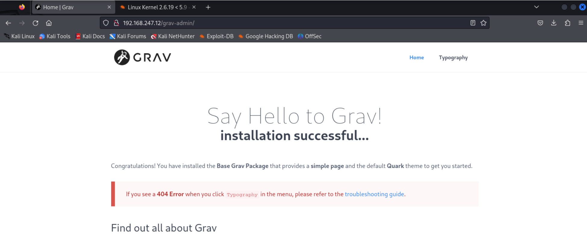
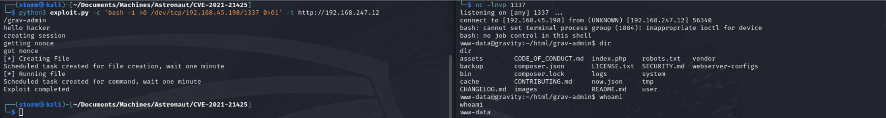
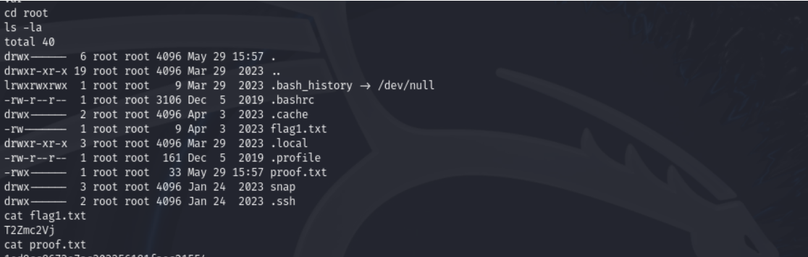

# Astronaut
Proving Grounds Practice
Difficulty - Easy

## Enumeration
```
PORT      STATE SERVICE            VERSION
PORT   STATE SERVICE VERSION
22/tcp open  ssh     OpenSSH 8.2p1 Ubuntu 4ubuntu0.5 (Ubuntu Linux; protocol 2.0)
| ssh-hostkey: 
|   3072 98:4e:5d:e1:e6:97:29:6f:d9:e0:d4:82:a8:f6:4f:3f (RSA)
|   256 57:23:57:1f:fd:77:06:be:25:66:61:14:6d:ae:5e:98 (ECDSA)
|_  256 c7:9b:aa:d5:a6:33:35:91:34:1e:ef:cf:61:a8:30:1c (ED25519)
80/tcp open  http    Apache httpd 2.4.41
|_http-title: Index of /
|_http-server-header: Apache/2.4.41 (Ubuntu)
| http-ls: Volume /
| SIZE  TIME              FILENAME
| -     2021-03-17 17:46  grav-admin/
|_
Service Info: Host: 127.0.0.1; OS: Linux; CPE: cpe:/o:linux:linux_kernel

```

### HTTP Port 80
GravCMS Unauthenticated Arbitrary YAML Write/Update leads to Code Execution (CVE-2021-21425)

```                                                                                          
└─$ sudo wfuzz -c -f sub-fighter.txt -Z -w /usr/share/seclists/Discovery/DNS/subdomains-top1million-5000.txt --sc 200,202,204,301,302,307,403 http://192.168.247.12/grav-admin/FUZZ
 /usr/lib/python3/dist-packages/wfuzz/__init__.py:34: UserWarning:Pycurl is not compiled against Openssl. Wfuzz might not work correctly when fuzzing SSL sites. Check Wfuzz's documentation for more information.
********************************************************
* Wfuzz 3.1.0 - The Web Fuzzer                         *
********************************************************

Target: http://192.168.247.12/grav-admin/FUZZ
Total requests: 4989

=====================================================================
ID           Response   Lines    Word       Chars       Payload                         
=====================================================================

000000024:   200        138 L    931 W      15508 Ch    "admin"                         
000000055:   301        9 L      28 W       328 Ch      "backup"                        
000000053:   301        9 L      28 W       328 Ch      "images"                        
000000108:   200        159 L    1203 W     14014 Ch    "home"                          
000000110:   200        189 L    969 W      13967 Ch    "login"                         
000000392:   301        9 L      28 W       328 Ch      "assets"                        
000000430:   301        9 L      28 W       327 Ch      "cache"                         
000000529:   301        9 L      28 W       326 Ch      "user"                          
000000760:   301        9 L      28 W       325 Ch      "tmp"                           
000000810:   301        9 L      28 W       328 Ch      "system"                        
000000974:   301        9 L      28 W       326 Ch      "logs"                          
000002329:   301        9 L      28 W       328 Ch      "vendor"                        

Total time: 0
Processed Requests: 4989
Filtered Requests: 4977
Requests/sec.: 0
```



## Exploit
The webserver on this machine is vulnerable to RCE. The CVE is CVE-2021-21425.
Using the exploit availabe in this github repository, I was able to exploit the vulnerablility and a get reverse shell. I did find a user named, alex, but I was not able to login as this user.



The /usr/bin/php has the SUID. Using GTFOBins, I was able to escalate my priveleges to root. I was able to find this SUID with manual enumeration and linpeas.


### Root Flag
