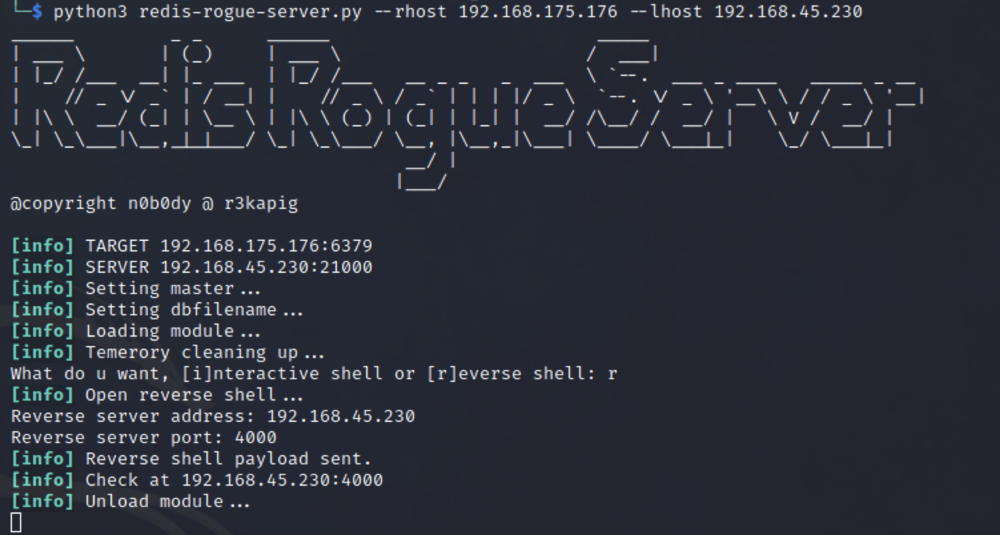

# Blackgate
Proving Grounds Practice
Difficulty - Hard


## Enumeration 
```
autorecon 192.168.175.176 -v
[*] Scanning target 192.168.175.176
[*] Port scan Top TCP Ports (top-tcp-ports) running against 192.168.175.176
[*] Port scan All TCP Ports (all-tcp-ports) running against 192.168.175.176
[*] Port scan Top 100 UDP Ports (top-100-udp-ports) running against 192.168.175.176
[!] [192.168.175.176/top-100-udp-ports] UDP scan requires AutoRecon be run with root privileges.
[*] [192.168.175.176/all-tcp-ports] Discovered open port tcp/22 on 192.168.175.176
[*] Identified service ssh on tcp/22 on 192.168.175.176
[*] Service scan Nmap SSH (tcp/22/ssh/nmap-ssh) running against 192.168.175.176
[*] 15:07:18 - There is 1 scan still running against 192.168.175.176: all-tcp-ports
[*] 15:08:18 - There is 1 scan still running against 192.168.175.176: all-tcp-ports
[*] 15:09:18 - There is 1 scan still running against 192.168.175.176: all-tcp-ports
[*] 15:10:18 - There is 1 scan still running against 192.168.175.176: all-tcp-ports
[*] [192.168.175.176/all-tcp-ports] Discovered open port tcp/6379 on 192.168.175.176
[*] 15:11:18 - There is 1 scan still running against 192.168.175.176: all-tcp-ports
[*] 15:12:18 - There is 1 scan still running against 192.168.175.176: all-tcp-ports
[*] 15:13:18 - There is 1 scan still running against 192.168.175.176: all-tcp-ports
[*] 15:14:18 - There is 1 scan still running against 192.168.175.176: all-tcp-ports
[*] Identified service redis on tcp/6379 on 192.168.175.176
[*] Service scan Nmap Redis (tcp/6379/redis/nmap-redis) running against 192.168.175.176
[*] Service scan Redis Cli (tcp/6379/redis/redis-cli) running against 192.168.175.176
[*] 15:15:18 - There is 1 scan still running against 192.168.175.176: tcp/6379/redis/nmap-redis                                                                                       
[*] Finished scanning target 192.168.175.176 in 9 minutes, 16 seconds
[*] Finished scanning all targets in 9 minutes, 17 seconds!
[*] Don't forget to check out more commands to run manually in the _manual_commands.txt file in each target's scans directory!

```

Below are my NMAP results.
```
└─$ nmap -p6379 -sC -sV 192.168.175.176
Starting Nmap 7.93 ( https://nmap.org ) at 2024-05-21 15:10 EDT
Nmap scan report for 192.168.175.176
Host is up (0.060s latency).

PORT     STATE SERVICE VERSION
6379/tcp open  redis   Redis key-value store 4.0.14

```


### Port 22 SSH
SSH Version -  OpenSSH 8.3p1 Ubuntu 1ubuntu0.1
This does not appear to be vulnerable.

### Port 6379 Redis
Redis Version - Redis key-value store 4.0.14

This version of redis is vulnerable to RCE. Before I found the RCE, here are some commands and screenshots of information that I found regarding the redis service running on the target machine.

```
─$ redis-cli -h 192.168.175.176                                                       
192.168.175.176:6379> info
# Server
redis_version:4.0.14
redis_git_sha1:00000000
redis_git_dirty:0
redis_build_id:25b410d64d050b9e
redis_mode:standalone
os:Linux 5.8.0-63-generic x86_64
arch_bits:64
multiplexing_api:epoll
atomicvar_api:atomic-builtin
gcc_version:10.2.0
process_id:874
run_id:1562f4a313670ec6a5c978d917fb3fefd8c25ee6
tcp_port:6379
uptime_in_seconds:13533815
uptime_in_days:156
hz:10
lru_clock:5044334
executable:/usr/local/bin/redis-server
config_file:

# Clients
connected_clients:1
client_longest_output_list:0
client_biggest_input_buf:0
blocked_clients:0

# Memory
used_memory:903639

```

The output did mention that there were 16 databases, however when I tried to get information I would be returned an empty array. 
```
192.168.175.176:6379> INFO keyspace
# Keyspace
192.168.175.176:6379> SElECT 0
OK
192.168.175.176:6379> KEYS *
(empty array)
192.168.175.176:6379> SElECT 1
OK
192.168.175.176:6379[1]> KEYS *
(empty array)
192.168.175.176:6379[1]> SElECT 2
OK
192.168.175.176:6379[2]> KEYS *
(empty array)

```

## Exploit
The target machine is vulnerable to a RCE because of a vulnerable version of Redis that is running. https://github.com/n0b0dyCN/redis-rogue-server





### Local Flag 


### Root Flag
