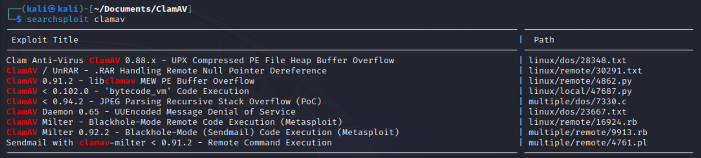
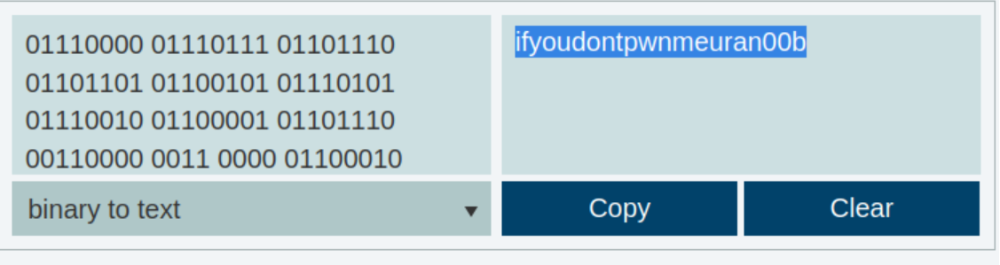
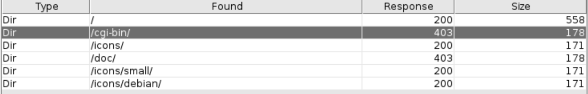
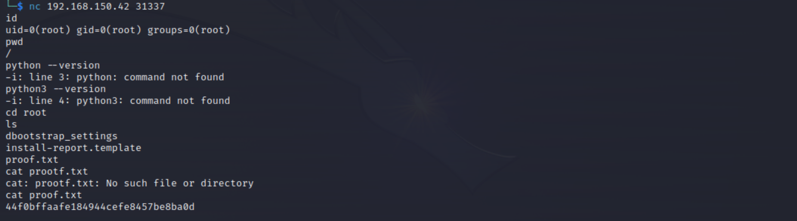

#ClaimAV
Machine: [ClaimAV](https://portal.offensive-security.com/labs/practice)\
Difficulty: Easy


## Enumeration
What ports are open? 

```
22/tcp    open  ssh         OpenSSH 3.8.1p1 Debian 8.sarge.6 (protocol 2.0)
| ssh-hostkey: 
|   1024 303ea4135f9a32c08e46eb26b35eee6d (DSA)
|_  1024 afa2493ed8f226124aa0b5ee6276b018 (RSA)
25/tcp    open  smtp        Sendmail 8.13.4/8.13.4/Debian-3sarge3
| smtp-commands: localhost.localdomain Hello [192.168.49.150], pleased to meet you, ENHANCEDSTATUSCODES, PIPELINING, EXPN, VERB, 8BITMIME, SIZE, DSN, ETRN, DELIVERBY, HELP
|_ 2.0.0 This is sendmail version 8.13.4 2.0.0 Topics: 2.0.0 HELO EHLO MAIL RCPT DATA 2.0.0 RSET NOOP QUIT HELP VRFY 2.0.0 EXPN VERB ETRN DSN AUTH 2.0.0 STARTTLS 2.0.0 For more info use "HELP <topic>". 2.0.0 To report bugs in the implementation send email to 2.0.0 sendmail-bugs@sendmail.org. 2.0.0 For local information send email to Postmaster at your site. 2.0.0 End of HELP info
80/tcp    open  http        Apache httpd 1.3.33 ((Debian GNU/Linux))
|_http-server-header: Apache/1.3.33 (Debian GNU/Linux)
|_http-title: Ph33r
| http-methods: 
|_  Potentially risky methods: TRACE
139/tcp   open  netbios-ssn Samba smbd 3.X - 4.X (workgroup: WORKGROUP)
199/tcp   open  smux        Linux SNMP multiplexer
445/tcp   open  netbios-ssn Samba smbd 3.0.14a-Debian (workgroup: WORKGROUP)
60000/tcp open  ssh         OpenSSH 3.8.1p1 Debian 8.sarge.6 (protocol 2.0)
| ssh-hostkey: 
|   1024 303ea4135f9a32c08e46eb26b35eee6d (DSA)
|_  1024 afa2493ed8f226124aa0b5ee6276b018 (RSA)
Service Info: Host: localhost.localdomain; OSs: Linux, Unix; CPE: cpe:/o:linux:linux_kernel

Host script results:
|_clock-skew: mean: 5h59m58s, deviation: 2h49m42s, median: 3h59m58s
|_nbstat: NetBIOS name: 0XBABE, NetBIOS user: <unknown>, NetBIOS MAC: 000000000000 (Xerox)
| smb-security-mode: 
|   account_used: guest
|   authentication_level: share (dangerous)
|   challenge_response: supported
|_  message_signing: disabled (dangerous, but default)
| smb-os-discovery: 
|   OS: Unix (Samba 3.0.14a-Debian)
|   NetBIOS computer name: 
|   Workgroup: WORKGROUP\x00
|_  System time: 2023-03-30T02:35:56-04:00
|_smb2-time: Protocol negotiation failed (SMB2)

```

### Credentials discovered (if any)

### Ports Info
#### SSH 22 and 60000
This version is not vulnerable. However, this might be leveraged if we find user credentials via other means of enumeration. 

#### SMTP 25
Just running nmap script we can enumerate users and other info. 
```
nmap 192.168.150.42 --script=smtp* -p 25
Starting Nmap 7.93 ( https://nmap.org ) at 2023-03-29 22:52 EDT
Nmap scan report for 192.168.150.42
Host is up (0.14s latency).

PORT   STATE SERVICE
25/tcp open  smtp
| smtp-commands: localhost.localdomain Hello [192.168.49.150], pleased to meet you, ENHANCEDSTATUSCODES, PIPELINING, EXPN, VERB, 8BITMIME, SIZE, DSN, ETRN, DELIVERBY, HELP
|_ 2.0.0 This is sendmail version 8.13.4 2.0.0 Topics: 2.0.0 HELO EHLO MAIL RCPT DATA 2.0.0 RSET NOOP QUIT HELP VRFY 2.0.0 EXPN VERB ETRN DSN AUTH 2.0.0 STARTTLS 2.0.0 For more info use "HELP <topic>". 2.0.0 To report bugs in the implementation send email to 2.0.0 sendmail-bugs@sendmail.org. 2.0.0 For local information send email to Postmaster at your site. 2.0.0 End of HELP info
| smtp-vuln-cve2010-4344: 
|_  The SMTP server is not Exim: NOT VULNERABLE
| smtp-enum-users: 
|   root
|   admin
|   administrator
|   webadmin
|   sysadmin
|   netadmin
|   guest
|   user
|   web
|_  test
|_smtp-open-relay: Server is an open relay (13/16 tests)

```

Searchsploit also reveals some information that might be useful.


#### Http 80
I did not find any relevant vulnerabilities for the version installed on this port. The webpage just contain binary numbers, so I will convert that.  Before that, I will run directory scans, etc., and see what we find.


Translating the binary text, I get this result: ifyoudontpwnmeuran00b.
 


I did not find anything in the directory scan that would be of use.

#### SMB 139/445
Just based off the nmap output above, the authentication level is dangerous so this might be useful to us.
```
└─$ smbmap -H 192.168.150.42
[+] Guest session       IP: 192.168.150.42:445  Name: 192.168.150.42                                    
        Disk                                                    Permissions     Comment
        ----                                                    -----------     -------
        print$                                                  NO ACCESS       Printer Drivers
        IPC$                                                    NO ACCESS       IPC Service (0xbabe server (Samba 3.0.14a-Debian) brave pig)
        ADMIN$                                                  NO ACCESS       IPC Service (0xbabe server (Samba 3.0.14a-Debian) brave pig)
```

I also ran enum4linux to find other information.

#### Smux 1999
To enumerate this, I used snmpwalk. Below is a snipet of the output...it returned quite a bit of information.
```
snmpwalk -c public -v1 -t 10 192.168.150.42
iso.3.6.1.2.1.1.1.0 = STRING: "Linux 0xbabe.local 2.6.8-4-386 #1 Wed Feb 20 06:15:54 UTC 2008 i686"
iso.3.6.1.2.1.1.2.0 = OID: iso.3.6.1.4.1.8072.3.2.10
iso.3.6.1.2.1.1.3.0 = Timeticks: (261487) 0:43:34.87
iso.3.6.1.2.1.1.4.0 = STRING: "Root <root@localhost> (configure /etc/snmp/snmpd.local.conf)"
iso.3.6.1.2.1.1.5.0 = STRING: "0xbabe.local"
iso.3.6.1.2.1.1.6.0 = STRING: "Unknown (configure /etc/snmp/snmpd.local.conf)"
iso.3.6.1.2.1.1.8.0 = Timeticks: (0) 0:00:00.00
iso.3.6.1.2.1.1.9.1.2.1 = OID: iso.3.6.1.2.1.31
iso.3.6.1.2.1.1.9.1.2.2 = OID: iso.3.6.1.6.3.1
iso.3.6.1.2.1.1.9.1.2.3 = OID: iso.3.6.1.2.1.49
```


## Exploit
Using the perl script that was listed in the searchsploit output, allows us to open a port on the machine and connect to it. [Exploit db](https://www.exploit-db.com/exploits/4761). After running the script, we can see a new port open in the nmap output.
```
nmap -p 31337 -sV 192.168.150.42
Starting Nmap 7.93 ( https://nmap.org ) at 2023-03-30 15:37 EDT
Nmap scan report for 192.168.150.42
Host is up (0.21s latency).

PORT      STATE SERVICE VERSION
31337/tcp open  Elite?

```

To connect back to the victim machine, we can use the netcat tool to connect to the port that was opened after running the script. 
```
nc 192.168.150.42 31337 
```
## Local/User Flag
N/A for this machine.

## Root Flag
