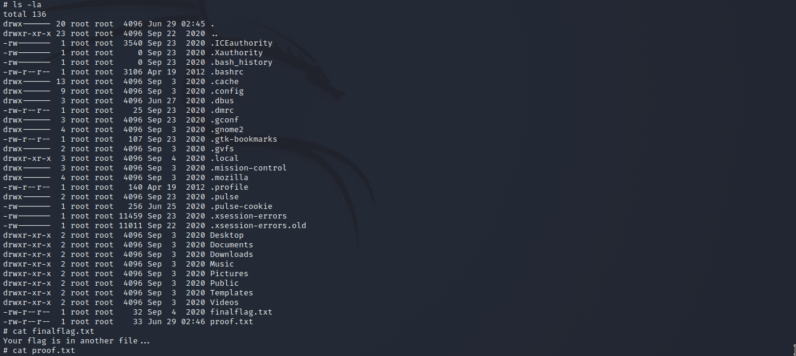

# CyberSploit1

Machine: [CyberSploit1](https://portal.offensive-security.com/labs/play)\
Difficulty: Easy


## Enumeration
What ports are open on this machine?
```
PORT   STATE SERVICE VERSION
22/tcp open  ssh     OpenSSH 5.9p1 Debian 5ubuntu1.10 (Ubuntu Linux; protocol 2.0)
| ssh-hostkey: 
|   1024 01:1b:c8:fe:18:71:28:60:84:6a:9f:30:35:11:66:3d (DSA)
|   2048 d9:53:14:a3:7f:99:51:40:3f:49:ef:ef:7f:8b:35:de (RSA)
|_  256 ef:43:5b:d0:c0:eb:ee:3e:76:61:5c:6d:ce:15:fe:7e (ECDSA)
80/tcp open  http    Apache httpd 2.2.22 ((Ubuntu))
|_http-title: Hello Pentester!
|_http-server-header: Apache/2.2.22 (Ubuntu)
Service Info: OS: Linux; CPE: cpe:/o:linux:linux_kernel

```

### SSH port 22
The ssh version does not appear to have any vulnerabilities that would be of use to me. However, if I find credentials then I may be able to use them to ssh into the machine.

## HTTP port 80


At first glance, I did not notice much but I looked at the page source and notice that there is a username in the comments. I did not know what it would be used for, so I proceeded with a directory scan for the webpage. The directory scan revealed, '/robots', which contained a suspicious string of characters. It looks to be a base 64 encoded string, so I will decode it. The decoded text revealed a link to well-known creator in the cyber field on Youtube. Below are screenshots of my enumeration.


Initially, I thought the decoded string wasn't the password because it was a string of text that had the link to a YouTube account but I went ahead and tried to log in via ssh with the decoded text as the password for the username I found. The credentials I found allowed me to log in!


## Exploitation

Since I was able to gain access without having to perform an exploit, this part will only pertain to escalating privileges. 


## Flags

### Local/User 
For the local/user flag, I was able to read the file contents without escalating privileges. 


### Root
To get the root flag, I uploaded linpeas onto the target machine and discovered it is vulnerable to a privilege escalation attack which will allow an attacker to gain root access. The exploit is located [here](https://www.exploit-db.com/exploits/37292). To run the exploit, I uploaded the file to the target machine, ran the instructions given in the exploit documentation, and gained root access!




## Overview
In this machine, I attacked a Linux machine that was vulnerable due to the developer/publisher of the webpage. The webpage had a username in the comments of the source code, and there is a file on the web server that contains that password for the username. Given the username and password that I discovered, I was able to ssh into the machine and escalate privileges due to a CVE.