# [EvilBox-One](https://portal.offensive-security.com/labs/play)

## Enumeration

I started with an nmap scan to find the open ports, and I additional scans based on the nmap output. In this case, I ran a dirbuster scan to find directories and other files.

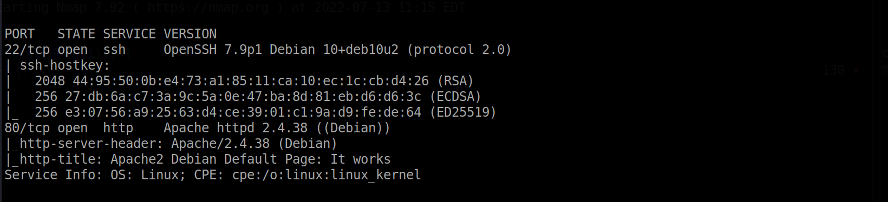

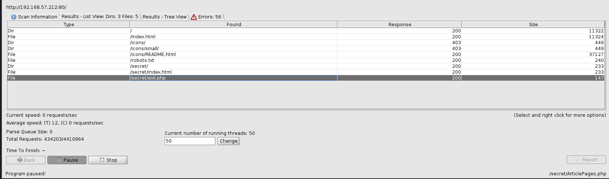

From the dirbuster output, we see that there is an evil.php file on the webserver and that it does not contain any information...it is just a blank page. From here, we can try paramter fuzzing to see what we can find. In the image below, I am using the ffuf tool and it is using the wordlist.

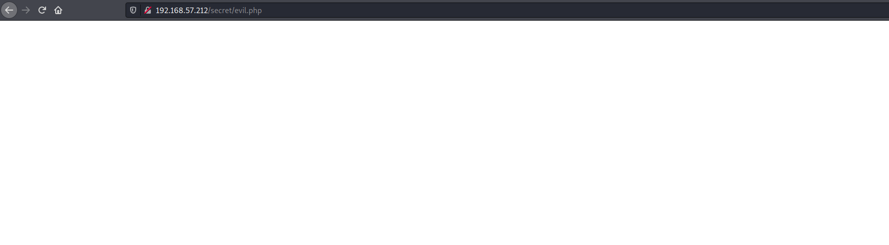

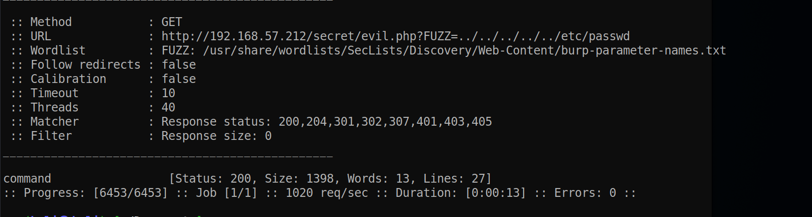

Now that we can view the /etc/passwd file, we can see that there is a user on this machine. Since we have exploited a LFI vulnerabilty and we know the user on the machine, let's try to get that users rsa key by going to /home/mowree/.ssh/id_rsa.  Now we have the user's RSA private key.

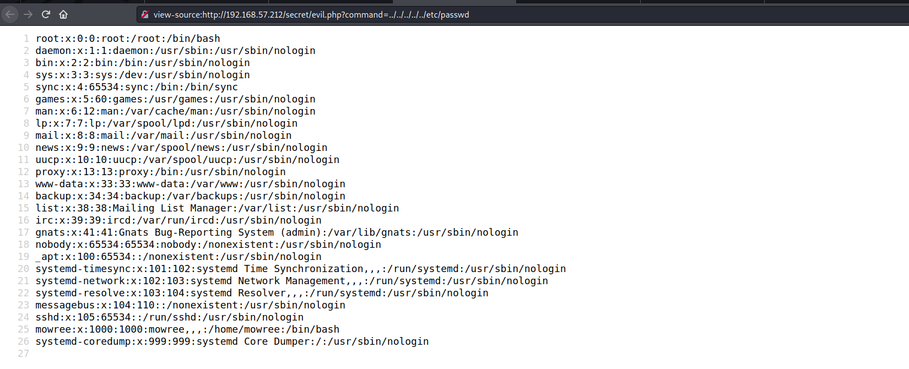

I attempt to login via ssh with the rsa key, but it turns out that you also have to enter the password for the user. I don't know the password but I can get it from the rsa key using a tool called ss2john. Basically will will get the password hash from the rsa key, and then use John The Ripper to crack the hashed password.

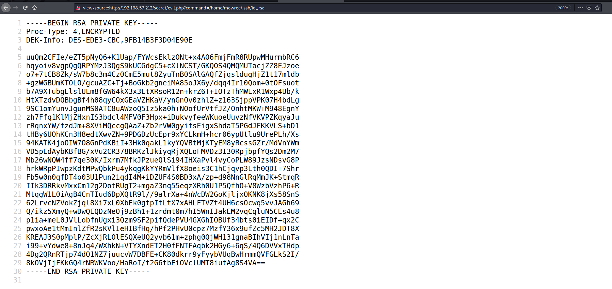

Now enter the following commands.

<pre>./ssh2john.py id_rsa > crackme</pre>

<pre>john --wordlist=/usr/share/wordlists/rockyou.txt crackme</pre>

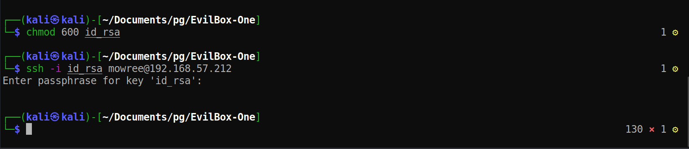

<pre>ssh -i id_rsa mowree@192.168.57.212</pre>

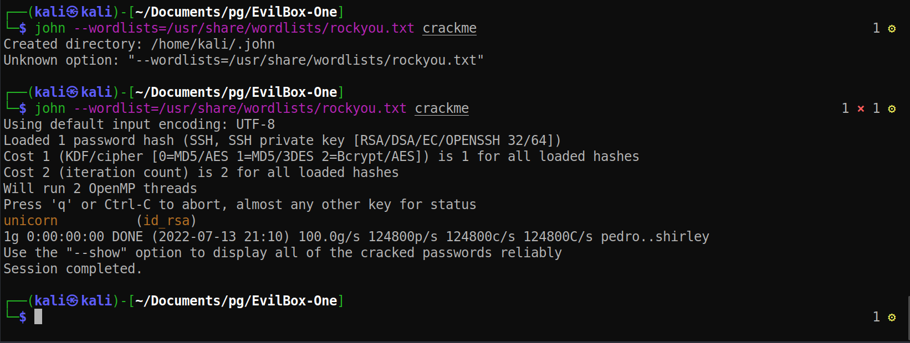

## Flags

### User/Local flag
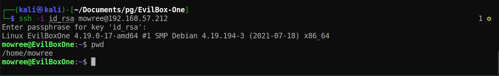

### Root flag
To escalate privileges, I uploaded linpeas and analyzed the output to find that we have write permissions to /etc/passwd!  This is good for us because we can basically add a new user to this file and add root privileges to the new user. To do this, I just ran the command to below which will add a user to the /etc/passwd. Once I run the command, I can then use su to change to that user. As a result, I will now have root privileges. 

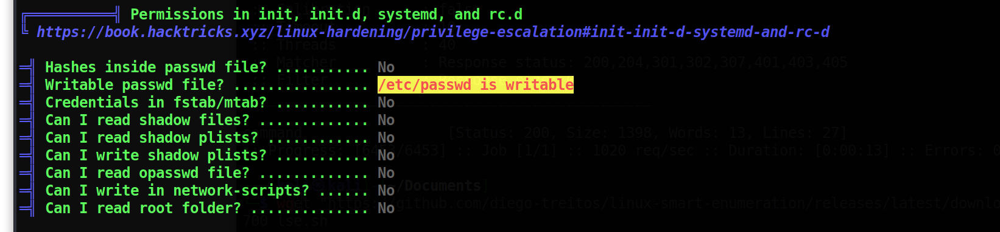

<pre>echo 'iamroot:fguk2XQir0LiQ:0:0:iamroot:/home/iamroot:/bin/bash' >> /etc/passwd</pre>

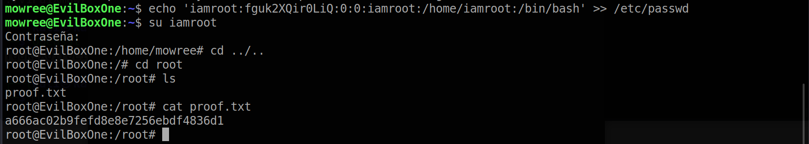
