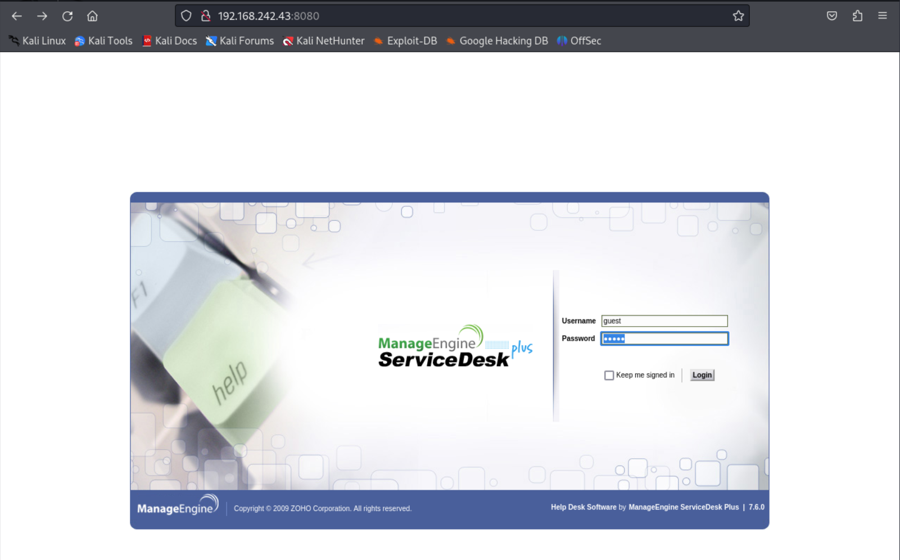
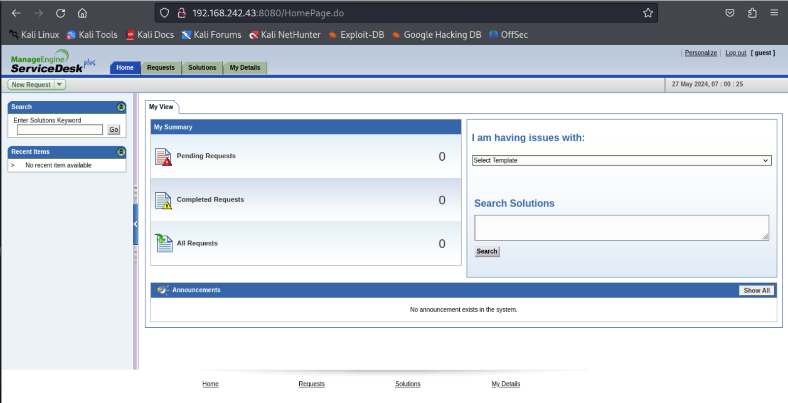
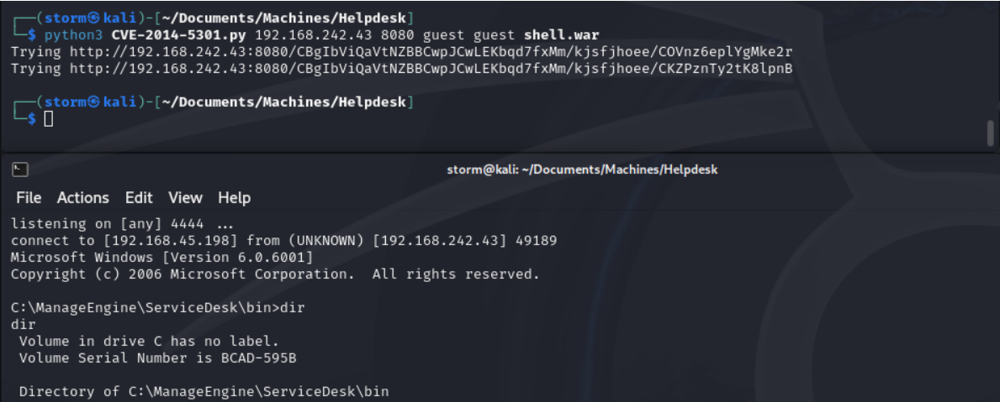
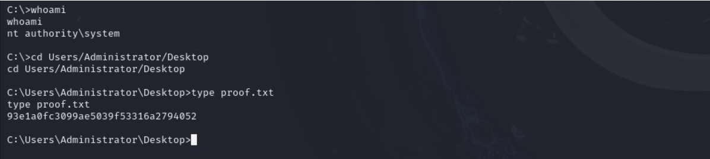

# Helpdesk
Proving Grounds Practice https://portal.offsec.com/labs/practice
Difficulty - Easy 


## Enumeration
```

PORT     STATE SERVICE       VERSION
135/tcp  open  msrpc         Microsoft Windows RPC
139/tcp  open  netbios-ssn   Microsoft Windows netbios-ssn
445/tcp  open  microsoft-ds  Windows Server (R) 2008 Standard 6001 Service Pack 1 microsoft-ds (workgroup: WORKGROUP)
3389/tcp open  ms-wbt-server Microsoft Terminal Service
8080/tcp open  http          Apache Tomcat/Coyote JSP engine 1.1
| http-cookie-flags: 
|   /: 
|     JSESSIONID: 
|_      httponly flag not set
|_http-server-header: Apache-Coyote/1.1
|_http-title: ManageEngine ServiceDesk Plus
Service Info: Host: HELPDESK; OS: Windows; CPE: cpe:/o:microsoft:windows, cpe:/o:microsoft:windows_server_2008:r2

Host script results:
|_nbstat: NetBIOS name: HELPDESK, NetBIOS user: <unknown>, NetBIOS MAC: 00:50:56:bf:85:af (VMware)
| smb-os-discovery: 
|   OS: Windows Server (R) 2008 Standard 6001 Service Pack 1 (Windows Server (R) 2008 Standard 6.0)
|   OS CPE: cpe:/o:microsoft:windows_server_2008::sp1
|   Computer name: HELPDESK
|   NetBIOS computer name: HELPDESK\x00
|   Workgroup: WORKGROUP\x00
|_  System time: 2024-05-27T07:48:20-07:00
| smb-security-mode: 
|   account_used: guest
|   authentication_level: user
|   challenge_response: supported
|_  message_signing: disabled (dangerous, but default)
| smb2-security-mode: 
|   2:0:2: 
|_    Message signing enabled but not required
|_clock-skew: mean: 2h20m01s, deviation: 4h02m29s, median: 0s
| smb2-time: 
|   date: 2024-05-27T14:48:20
|_  start_date: 2024-05-27T14:46:44

```


### HTTP 
Version - Apache Tomcat/Coyote JSP engine 1.1
Vulnerable website to this exploit - https://github.com/PeterSufliarsky/exploits/blob/master/CVE-2014-5301.py







### SMB
I was able to login with guest/guest, but then it would always give an error. 
```
└─$ smbclient //192.168.242.43/guest
Password for [WORKGROUP\storm]:
Anonymous login successful
tree connect failed: NT_STATUS_BAD_NETWORK_NAME

```

## Exploit
I found a python exploit availble on github for this CVE, CVE-2014-5301. This CVE exploits directory traversal vulnerability in the ManageEninge ServiceDesk Plus 7.6.0. Use the python script, I was able to get a reverse shell.



### Root Flag
```
C:\>whoami
whoami
nt authority\system

```
