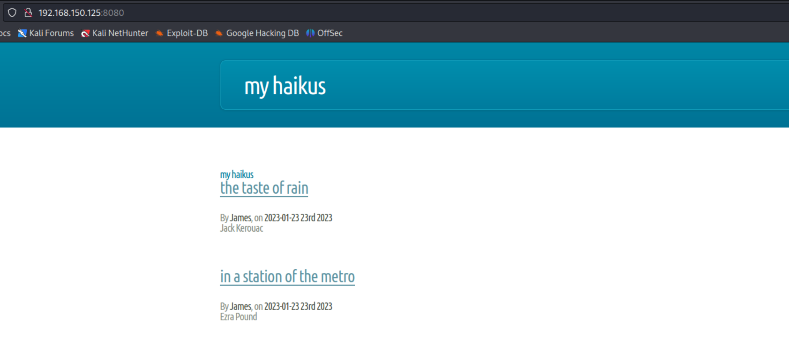
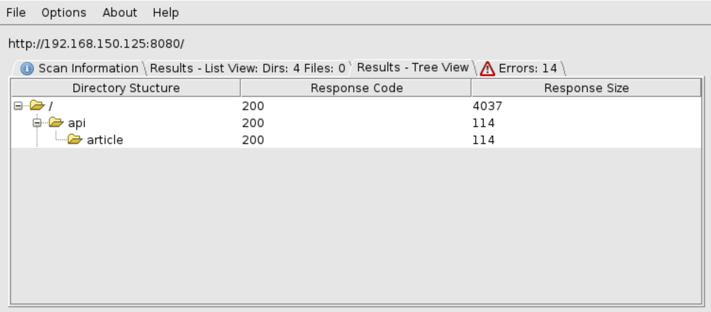
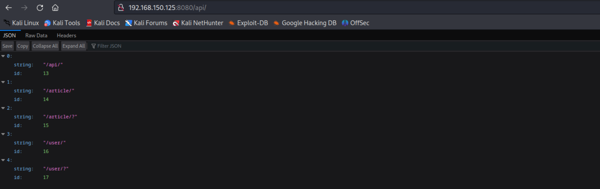
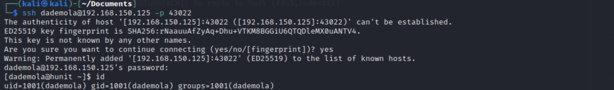
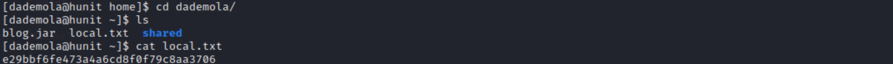

# Hunit
Machine: [Hunit](https://portal.offensive-security.com/labs/practice)\
Difficulty: Hard\


## Enumeration
What ports are open? The below nmap results did not come back at first. Originally the http proxy was only being returned. 

```
PORT      STATE SERVICE     VERSION
8080/tcp  open  http-proxy
12445/tcp open  netbios-ssn Samba smbd 4.6.2
18030/tcp open  http        Apache httpd 2.4.46 ((Unix))
43022/tcp open  ssh         OpenSSH 8.4 (protocol 2.0)
1 service unrecognized despite returning data. If you know the service/version, please submit the following fingerprint at https://nmap.org/cgi-bin/submit.cgi?new-service :
SF-Port8080-TCP:V=7.93%I=7%D=3/29%Time=6424E5CA%P=x86_64-pc-linux-gnu%r(Ge
SF:tRequest,F51,"HTTP/1\.1\x20200\x20\r\nContent-Type:\x20text/html;charse
SF:t=UTF-8\r\nContent-Language:\x20en-US\r\nContent-Length:\x203762\r\nDat
SF:e:\x20Thu,\x2030\x20Mar\x202023\x2001:28:42\x20GMT\r\nConnection:\x20cl
SF:ose\r\n\r\n<!DOCTYPE\x20HTML>\n<!--\n\tMinimaxing\x20by\x20HTML5\x20UP\
SF:n\thtml5up\.net\x20\|\x20@ajlkn\n\tFree\x20for\x20personal\x20and\x20co
SF:mmercial\x20use\x20under\x20the\x20CCA\x203\.0\x20license\x20\(html5up\
SF:.net/license\)\n-->\n<html>\n\t<head>\n\t\t<title>My\x20Haikus</title>\
SF:n\t\t<meta\x20charset=\"utf-8\"\x20/>\n\t\t<meta\x20name=\"viewport\"\x
SF:20content=\"width=device-width,\x20initial-scale=1,\x20user-scalable=no
SF:\"\x20/>\n\t\t<link\x20rel=\"stylesheet\"\x20href=\"/css/main\.css\"\x2
SF:0/>\n\t</head>\n\t<body>\n\t\t<div\x20id=\"page-wrapper\">\n\n\t\t\t<!-
SF:-\x20Header\x20-->\n\t\t\t\n\t\t\t\t<div\x20id=\"header-wrapper\">\n\t\
SF:t\t\t\t<div\x20class=\"container\">\n\t\t\t\t\t\t<div\x20class=\"row\">
SF:\n\t\t\t\t\t\t\t<div\x20class=\"col-12\">\n\n\t\t\t\t\t\t\t\t<header\x2
SF:0id=\"header\">\n\t\t\t\t\t\t\t\t\t<h1><a\x20href=\"/\"\x20id=\"logo\">
SF:My\x20Haikus</a></h1>\n\t\t\t\t\t\t\t\t</header>\n\n\t\t\t\t\t\t\t</div
SF:>\n\t\t\t\t\t\t</div>\n\t\t\t\t\t</div>\n\t\t\t\t</div>\n\t\t\t\t\n\n\t
SF:\t\t\n\t\t\t\t<div\x20id=\"main\">\n\t\t\t\t\t<div\x20clas")%r(HTTPOpti
SF:ons,75,"HTTP/1\.1\x20200\x20\r\nAllow:\x20GET,HEAD,OPTIONS\r\nContent-L
SF:ength:\x200\r\nDate:\x20Thu,\x2030\x20Mar\x202023\x2001:28:42\x20GMT\r\
SF:nConnection:\x20close\r\n\r\n")%r(RTSPRequest,259,"HTTP/1\.1\x20505\x20
SF:\r\nContent-Type:\x20text/html;charset=utf-8\r\nContent-Language:\x20en
SF:\r\nContent-Length:\x20465\r\nDate:\x20Thu,\x2030\x20Mar\x202023\x2001:
SF:28:42\x20GMT\r\n\r\n<!doctype\x20html><html\x20lang=\"en\"><head><title
SF:>HTTP\x20Status\x20505\x20\xe2\x80\x93\x20HTTP\x20Version\x20Not\x20Sup
SF:ported</title><style\x20type=\"text/css\">body\x20{font-family:Tahoma,A
SF:rial,sans-serif;}\x20h1,\x20h2,\x20h3,\x20b\x20{color:white;background-
SF:color:#525D76;}\x20h1\x20{font-size:22px;}\x20h2\x20{font-size:16px;}\x
SF:20h3\x20{font-size:14px;}\x20p\x20{font-size:12px;}\x20a\x20{color:blac
SF:k;}\x20\.line\x20{height:1px;background-color:#525D76;border:none;}</st
SF:yle></head><body><h1>HTTP\x20Status\x20505\x20\xe2\x80\x93\x20HTTP\x20V
SF:ersion\x20Not\x20Supported</h1></body></html>");

```
### Credentials discovered
```
login	"rjackson"
password	"yYJcgYqszv4aGQ"
firstname	"Richard"
lastname	"Jackson"
description	"Editor"

login	"jsanchez"
password	"d52cQ1BzyNQycg"
firstname	"Jennifer"
lastname	"Sanchez"
description	"Editor"


login	"dademola"
password	"ExplainSlowQuest110"
firstname	"Derik"
lastname	"Ademola"
description	"Admin"


login	"jwinters"
password	"KTuGcSW6Zxwd0Q"
firstname	"Julie"
lastname	"Winters"
description	"Editor"

	
login	"jvargas"
password	"OuQ96hcgiM5o9w"
firstname	"James"
lastname	"Vargas"
```

### Ports Info
#### Http Proxy 8080
This appears to just be a normal page with links to articles. How I ran a directory scan on the page and got the below results. This scan revealed some sort of API that has information for users and articles. 









#### SMB 12445

#### Http 18030

#### SSH 43022
This version is not vulnerable. However, this might be leveraged if we find user credentials via other means of enumeration. 

## Exploit

Given the first thing I enumerated resulted in me finding information that lead to a shell, I did not bother enumerating the remaining services running on this machine.  With the credentials found for the 'admin' based on the description in the '/api/users' endpoint, I was able to use them to ssh into the machine.

## Local/User Flag


## Root Flag
I could not move linpeas to the target machine, and I suspect some sort of firewall or proxy is causing this but I am not sure. I turned to manual priv esc techniques. I did run the below command and found an interesting file for a user named 'git'. 
```
[dademola@hunit ~]$ find / -name id_rsa 2>/dev/null
/home/git/.ssh/id_rsa
```


