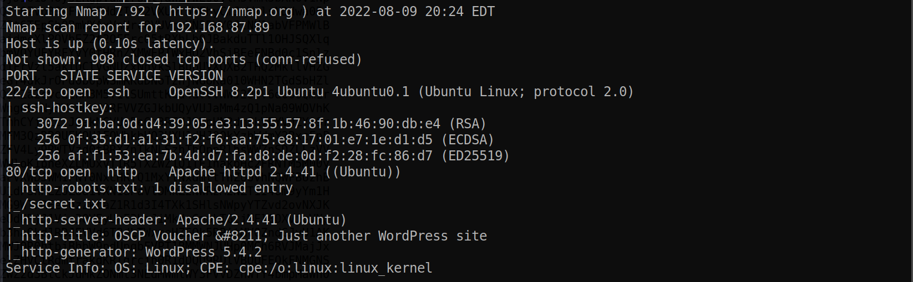
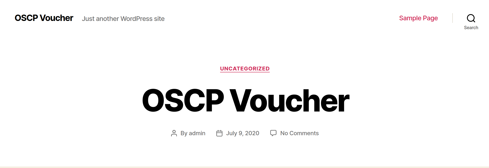
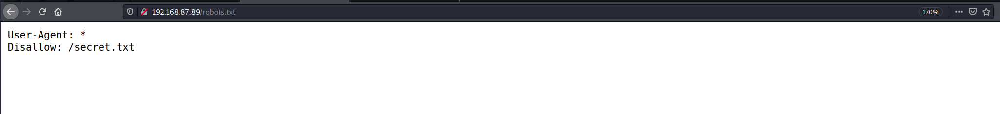
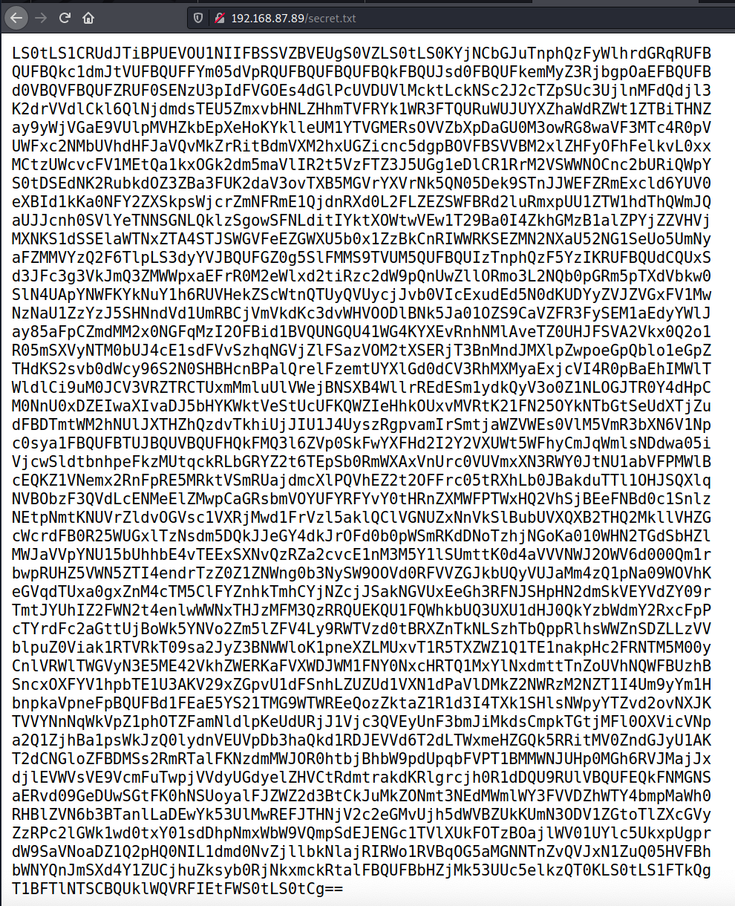
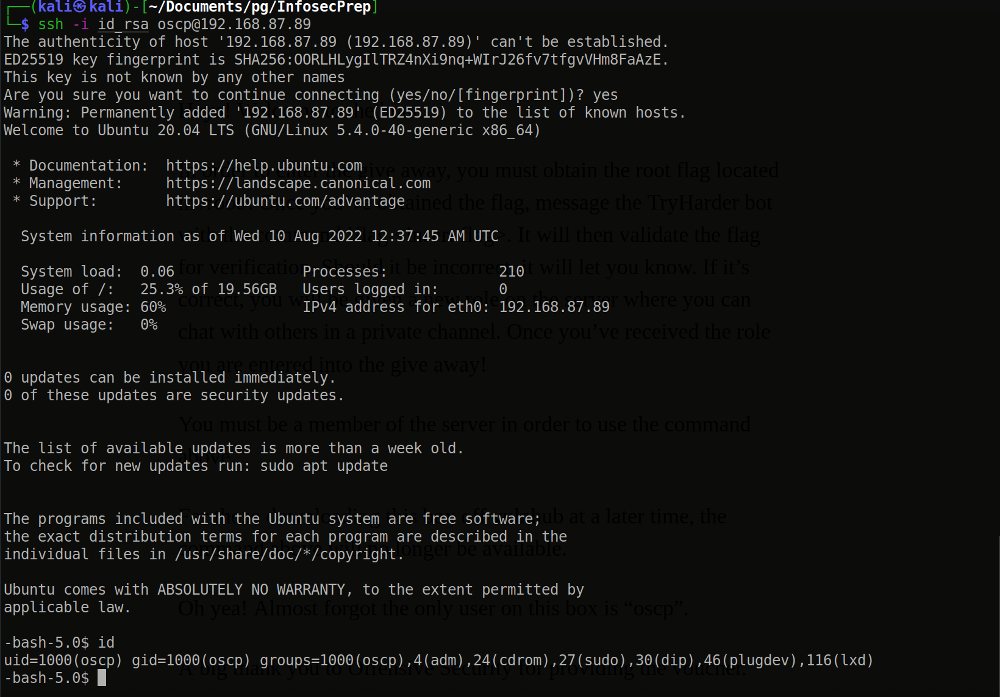
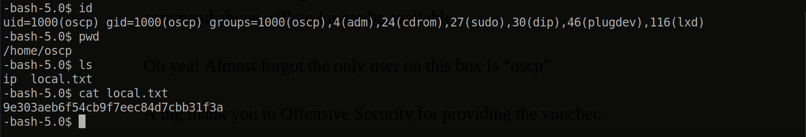
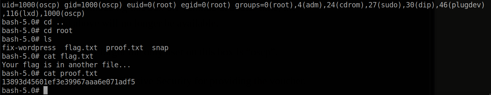

# InfosecPrep

Machine: [InfosecPrep](https://portal.offensive-security.com/labs/play)

## Enumeration

What are the versions of the services?\
22/ssh - OpenSSH 8.2p1 Ubuntu 4ubuntu0.1 (Ubuntu Linux; protocol 2.0)\
80/http - Apache httpd 2.4.41 ((Ubuntu))\

### Ssh
At first glance, this version does not appear to be vulnerable to anything. However, if I find any credentials then I might be able to use them via ssh to login.

### Http
I did not see any vulnerabilites online for the apache version in use, but I did learn that this is a wordpress site once I visited the home page of the webserver. I started a dirbuster scan, but the results did not have anything of interest. In the nmap output, we can see that there is a robots.txt file on the webserver, going to robots.txt reveals that there is a file named secret.txt that is on this webserver. The secret.txt file contained base64 text so I decoded the text to discover that it is a private rsa key!

I saved the rsa key to file on my machine, ran the below command, and logged in with the user 'oscp'. On the homepage of this webserver, it gives a little hint about the user on the machine...it directly tells us that the only user on the machine is 'oscp'. Since they provided me with the username on the machine and I found an rsa key, I tried to login via ssh which resulted in a successfully login attempt! I ran the below commands once I saved the rsa key to a file.

<pre>chmod 600 id_rsa</pre>

<pre>ssh -i id_rsa oscp@192.168.87.89</pre>

## Flags

### User/Local flag

### Root flag

