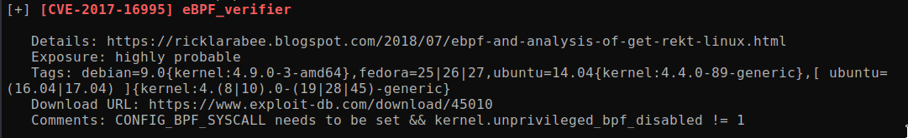

# Loly

Machine: [Loly](https://portal.offensive-security.com/labs/play)\
Difficulty: Get to work

## Enumeration

What operating system is on this machine? Linux
What ports/services are on running on this machine?

I ran a dirbuster scan since there is a webserver running on port 80. Based on this output I discovered that wordpress is being used on this machine so I go ahead and use the wpscan tool to do more enumeration. From the wpscan, I found that there is a user named loly. I can re affirm that there is a user name loly due to the wordpress page we can view after adding loly.lc to my /etc/hosts file.\

Since we have a username, lets try to brute force the password using wpscan. I used the below command.
<pre>wpscan --url http://192.168.57.121/wordpress/ --usernames loly --passwords /usr/share/wordlists/rockyou.txt</pre>

Now that I can login to the wordpress site, I am trying to find something that I can exploit and I find that there is a file upload option on a webpage.

In the page it does note that when you upload a zip file that it automatically unzips, so this gave me the idea to try uploading a php reverse shell with the .zip extension.  Previously I tried to upload something like, reverse-shell.php.jpg, but I could not get it to work properly. I created a zip file of my reverse shell, reverse-shell.php.zip, and upload that to the page. Now when I go to the path of the zip file I just uploaded, I am able to get a reverse shell! This works because the zip file is automatically unzipped when it is uploaded. This results in the the upload just being a file of whatever type it was before you made it a zip file. In my case, it is now reverse-shell.php and I can access it by navigating to the link in the screenshot or use this command below:
<pre>curl -v http://loly.lc/wordpress/wp-content/banners/reverse-shell.php</pre>

## Flags
### Local/User

### Root
For the root flag, I needed to figure out way to escalate my privileges. I went ahead an run some normal commands to search for files with SUID etc. but I did not find anything that would help. Then I uploaded linpeas.sh and found a few things of interest. The first was the kernel version...I used the exploit from exploit db but I did not have any success. However, I did have success using the first CVE that was mentioned in linpeas.\

Now after downloading the exploit [here](https://www.exploit-db.com/exploits/45010), I was able to get root access!

