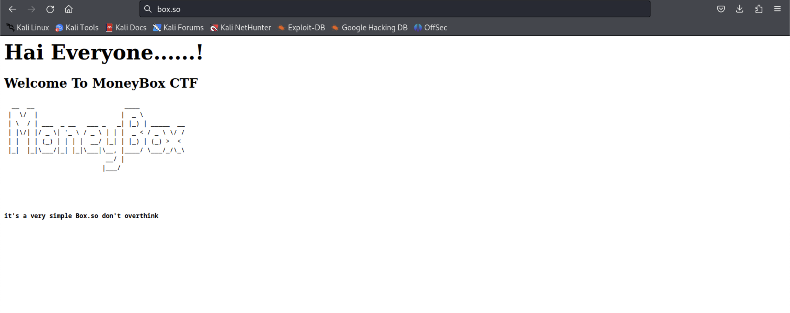
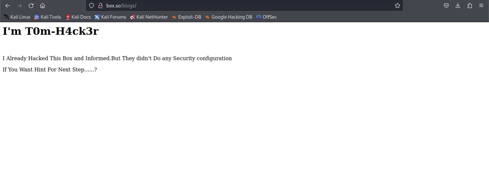
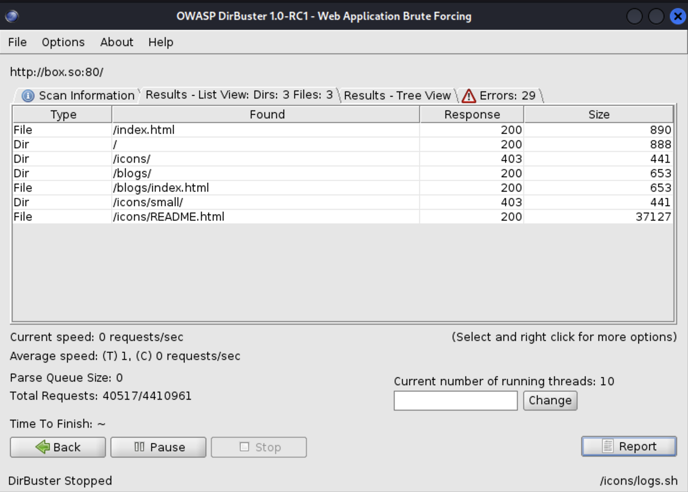
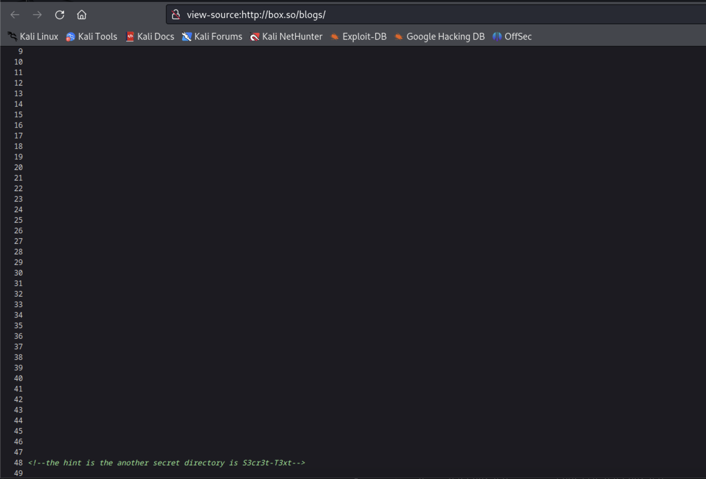
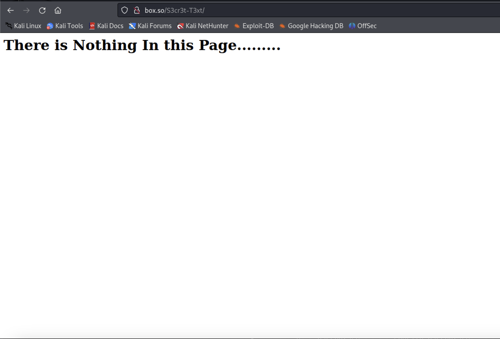
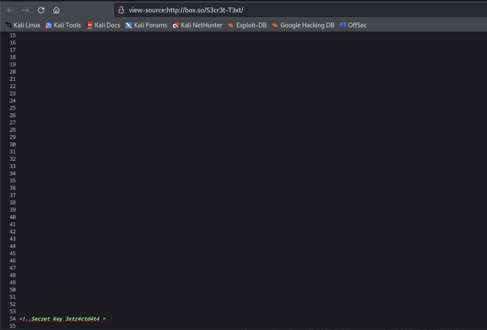
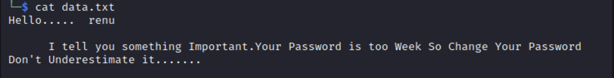
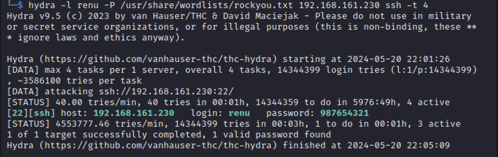
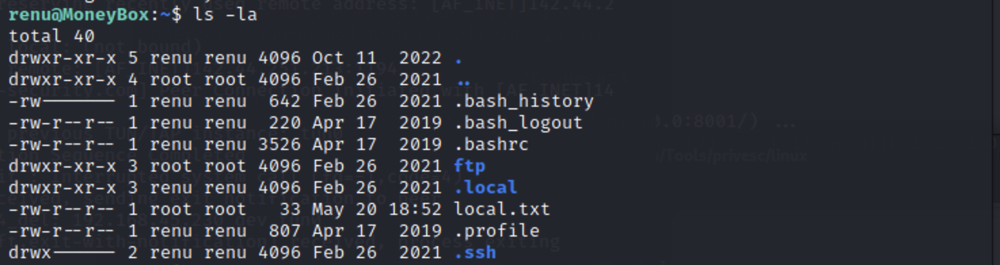

# MoneyBox
Proving Grounds Play
Difficulty - Easy 

## Enumeration
```
21/tcp open  ftp     vsftpd 3.0.3
| ftp-anon: Anonymous FTP login allowed (FTP code 230)
|_-rw-r--r--    1 0        0         1093656 Feb 26  2021 trytofind.jpg
| ftp-syst: 
|   STAT: 
| FTP server status:
|      Connected to ::ffff:192.168.45.230
|      Logged in as ftp
|      TYPE: ASCII
|      No session bandwidth limit
|      Session timeout in seconds is 300
|      Control connection is plain text
|      Data connections will be plain text
|      At session startup, client count was 1
|      vsFTPd 3.0.3 - secure, fast, stable
|_End of status
22/tcp open  ssh     OpenSSH 7.9p1 Debian 10+deb10u2 (protocol 2.0)
| ssh-hostkey: 
|   2048 1e30ce7281e0a23d5c28888b12acfaac (RSA)
|   256 019dfafbf20637c012fc018b248f53ae (ECDSA)
|_  256 2f34b3d074b47f8d17d237b12e32f7eb (ED25519)
80/tcp open  http    Apache httpd 2.4.38 ((Debian))
|_http-server-header: Apache/2.4.38 (Debian)
|_http-title: MoneyBox
Service Info: OSs: Unix, Linux; CPE: cpe:/o:linux:linux_kernel

```

### Port 21 SSH
This does not appear to be vulnerable. 


### Port 22 FTP 
I can login to FTP using anonymous login. Once logged in, I discovered an image file which I copied to my machine.

### Port 80 HTTP
The webserver running on this machine has a few webpages that do not appear to contain any information, but they left information in the comments of the webpage.



Next, I performed a directory scan and discovered more information in the comments of the page source on different pages.



The /blogs page source mentioned another directory which was not returned in my directory scan. I navigate to that site and find more information in the page source.







## Exploit
Based on the 'extracted' message I found and the image that was on the FTP server, I was able to extract some information from the image.  The first tool I used I did not have any success getting the correct information. I tried using ```steghide``` and found the below message that contained a username.  From there, I tried maunal password login and did not have any success, so I used hydra to brute force the password.




### Local Flag


### Root Flag


