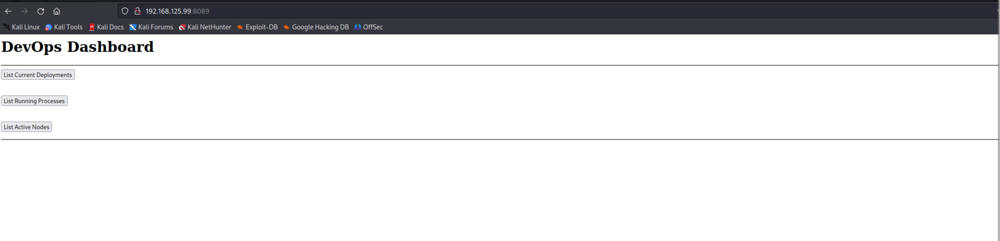
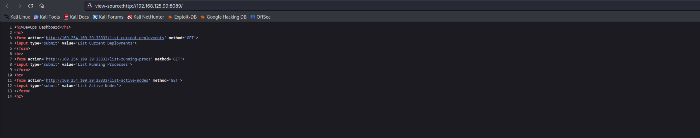
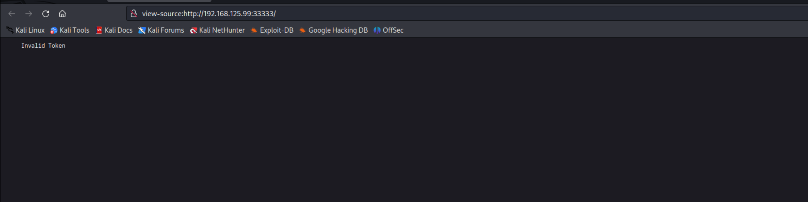
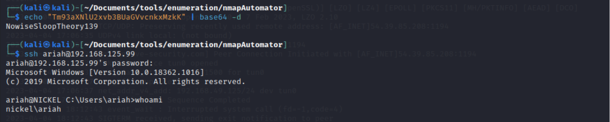
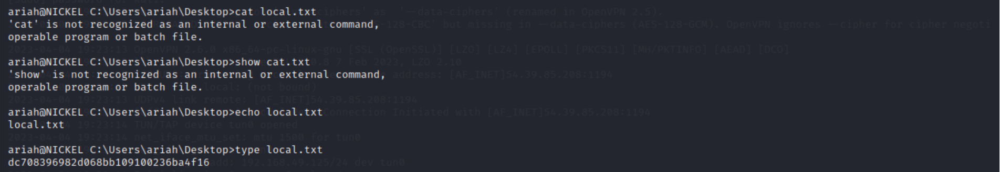

# Nickel
Machine: [Nickel](https://portal.offensive-security.com/labs/practice)\
Difficulty: Hard


## Enumeration
What ports are open? 
```
PORT      STATE SERVICE       VERSION
21/tcp    open  ftp           FileZilla ftpd
22/tcp    open  ssh           OpenSSH for_Windows_8.1 (protocol 2.0)
135/tcp   open  msrpc         Microsoft Windows RPC
139/tcp   open  netbios-ssn   Microsoft Windows netbios-ssn
3389/tcp  open  ms-wbt-server Microsoft Terminal Services
8089/tcp  open  http          Microsoft HTTPAPI httpd 2.0 (SSDP/UPnP)
33333/tcp open  http          Microsoft HTTPAPI httpd 2.0 (SSDP/UPnP)

```

### Credentials discovered (if any)
Possible creds were discovered from the process output of the curl POST request on port 8089.
ariah - Tm93aXNlU2xvb3BUaGVvcnkxMzkK

### Ports Info
#### FTP/21
Scanned at 2023-04-04 08:43:13 EDT for 681s
Not shown: 994 filtered tcp ports (no-response)
PORT     STATE SERVICE       REASON
21/tcp   open  ftp           syn-ack
| ftp-syst: 
|_  SYST: UNIX emulated by FileZilla
| ftp-brute: 
|   Accounts: No valid accounts found
|_  Statistics: Performed 615 guesses in 672 seconds, average tps: 0.9

I am not sure which version of filezilla is installed, it would be useful.

#### SSH/22
The version running on the target machine, OpenSSH Windows 8.1, might be vulnerable to this [exploit](https://www.exploit-db.com/exploits/21314).  Valid credentials might be needed for this exploit to be successful.

#### MSRPC/135

#### NETBIOS-ssn/139
This is smb. Below are the commands I ran to enumerate this service. 

```
└─$ smbclient -L 192.168.125.99
do_connect: Connection to 192.168.125.99 failed (Error NT_STATUS_IO_TIMEOUT)

```

I also ran smbmap and enum4linux, and I did not have any success.
#### ms-wbt-server/3389 (RDP)
To enumerate RDP, I ran the below command. The brelow command checks the available encryption and DoS vulnerability (without causing DoS to the service and obtains NTLM Windows info (versions).
```
└─$ nmap --script "rdp-enum-encryption or rdp-vuln-ms12-020 or rdp-ntlm-info" -Pn3389 -T4 192.168.125.99 
.
.
.

3389/tcp open  ms-wbt-server
| rdp-enum-encryption: 
|   Security layer
|     CredSSP (NLA): SUCCESS
|     CredSSP with Early User Auth: SUCCESS
|_    RDSTLS: SUCCESS
| rdp-ntlm-info: 
|   Target_Name: NICKEL
|   NetBIOS_Domain_Name: NICKEL
|   NetBIOS_Computer_Name: NICKEL
|   DNS_Domain_Name: nickel
|   DNS_Computer_Name: nickel
|   Product_Version: 10.0.18362
|_  System_Time: 2023-04-04T21:31:15+00:00
.
.
.
```

#### http/8089

In the page source, we can see that it tries to make a GET request to a different IP address and port. This is interesting. 



I also tried to curl the pages to see what is returned, and I did not get any information. This command was a GET request, but let me try with a POST request.
```
└─$ curl http://169.254.109.39:33333/list-current-deployments
curl: (7) Failed to connect to 169.254.109.39 port 33333 after 3077 ms: Couldn't connect to server
                                                                                                                                                            
┌──(kali㉿kali)-[~/Documents/tools/enumeration/nmapAutomator]
└─$ curl http://169.254.109.39:33333/list-running-procs      
curl: (7) Failed to connect to 169.254.109.39 port 33333 after 3078 ms: Couldn't connect to server
                                                                                                                                                            
┌──(kali㉿kali)-[~/Documents/tools/enumeration/nmapAutomator]
└─$ curl http://169.254.109.39:33333/list-active-nodes 
curl: (7) Failed to connect to 169.254.109.39 port 33333 after 3072 ms: Couldn't connect to server

```

I reset the machine and tried again. I got the same result and then I tried with the IP address of the target machine and I got a response from the /list-running-procs endpoint. Since it does not show anything for a "GET" request, I tried with a post request using the curl command line tool. 


```
curl -X POST http://192.168.125.99:33333/list-running-procs
<!DOCTYPE HTML PUBLIC "-//W3C//DTD HTML 4.01//EN""http://www.w3.org/TR/html4/strict.dtd">
<HTML><HEAD><TITLE>Length Required</TITLE>
<META HTTP-EQUIV="Content-Type" Content="text/html; charset=us-ascii"></HEAD>
<BODY><h2>Length Required</h2>
<hr><p>HTTP Error 411. The request must be chunked or have a content length.</p>
</BODY></HTML>

```

```
┌──(kali㉿kali)-[~/Documents/tools/enumeration/nmapAutomator]
└─$ curl -d "" -X POST http://192.168.125.99:33333/list-running-procs


name        : System Idle Process
commandline : 

name        : System
commandline : 

name        : Registry
commandline : 

name        : smss.exe
commandline : 

name        : csrss.exe
commandline : 

name        : wininit.exe
commandline : 

name        : csrss.exe
commandline : 

name        : winlogon.exe
commandline : winlogon.exe

name        : services.exe
commandline : 

name        : lsass.exe
commandline : C:\Windows\system32\lsass.exe

name        : fontdrvhost.exe
commandline : "fontdrvhost.exe"

name        : fontdrvhost.exe
commandline : "fontdrvhost.exe"

name        : dwm.exe
commandline : "dwm.exe"

name        : powershell.exe
commandline : powershell.exe -nop -ep bypass C:\windows\system32\ws80.ps1

name        : Memory Compression
commandline : 

name        : cmd.exe
commandline : cmd.exe C:\windows\system32\DevTasks.exe --deploy C:\work\dev.yaml --user ariah -p 
              "Tm93aXNlU2xvb3BUaGVvcnkxMzkK" --server nickel-dev --protocol ssh

name        : powershell.exe
commandline : powershell.exe -nop -ep bypass C:\windows\system32\ws8089.ps1

name        : powershell.exe
commandline : powershell.exe -nop -ep bypass C:\windows\system32\ws33333.ps1

name        : spoolsv.exe
commandline : C:\Windows\System32\spoolsv.exe

name        : conhost.exe
commandline : \??\C:\Windows\system32\conhost.exe 0x4

name        : FileZilla Server.exe
commandline : "C:\Program Files (x86)\FileZilla Server\FileZilla Server.exe"

name        : sshd.exe
commandline : "C:\Program Files\OpenSSH\OpenSSH-Win64\sshd.exe"

name        : VGAuthService.exe
commandline : "C:\Program Files\VMware\VMware Tools\VMware VGAuth\VGAuthService.exe"

name        : vmtoolsd.exe
commandline : "C:\Program Files\VMware\VMware Tools\vmtoolsd.exe"

name        : dllhost.exe
commandline : C:\Windows\system32\dllhost.exe /Processid:{02D4B3F1-FD88-11D1-960D-00805FC79235}

name        : WmiPrvSE.exe
commandline : C:\Windows\system32\wbem\wmiprvse.exe

name        : LogonUI.exe
commandline : "LogonUI.exe" /flags:0x2 /state0:0xa392c855 /state1:0x41c64e6d

name        : msdtc.exe
commandline : C:\Windows\System32\msdtc.exe

name        : conhost.exe
commandline : \??\C:\Windows\system32\conhost.exe 0x4

name        : conhost.exe
commandline : \??\C:\Windows\system32\conhost.exe 0x4

name        : conhost.exe
commandline : \??\C:\Windows\system32\conhost.exe 0x4

name        : WmiPrvSE.exe
commandline : C:\Windows\system32\wbem\wmiprvse.exe

name        : SgrmBroker.exe
commandline : 

name        : SearchIndexer.exe
commandline : C:\Windows\system32\SearchIndexer.exe /Embedding

name        : CompatTelRunner.exe
commandline : C:\Windows\system32\compattelrunner.exe

name        : conhost.exe
commandline : \??\C:\Windows\system32\conhost.exe 0x4

name        : CompatTelRunner.exe
commandline : C:\Windows\system32\compattelrunner.exe -maintenance

name        : conhost.exe
commandline : \??\C:\Windows\system32\conhost.exe 0x4

name        : WmiApSrv.exe
commandline : C:\Windows\system32\wbem\WmiApSrv.exe

```


NOTE:

Maybe do potential directory fuzz since the directory scan did not return anything. 

#### http/33333
There is nothing returned from the directory scan, but the page says 'invalid token'.



## Exploit

After my enumeration, I thought I had a clear path to get into the machine. I found a set of credentials from the list of running processes on the target machine. The credentials were passed in the command line, but I am not able to use them to ssh or rdp into the target. Turns out I needed to decode the password I discovered and then use that to log in.

```
└─$ echo "Tm93aXNlU2xvb3BUaGVvcnkxMzkK" | base64 -d
```



## Local/User Flag
I apologize for being a windows noob :)


## Root Flag
