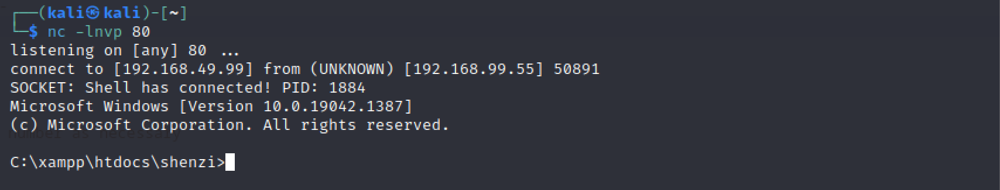

# Shenzi
Machine: [Shenzi](https://portal.offensive-security.com/labs/practice)\
Difficulty: Hard\


## Enumeration
What ports are open?
```
PORT     STATE SERVICE       VERSION
21/tcp   open  ftp           FileZilla ftpd 0.9.41 beta
80/tcp   open  http          Apache httpd 2.4.43 ((Win64) OpenSSL/1.1.1g PHP/7.4.6)
|_http-server-header: Apache/2.4.43 (Win64) OpenSSL/1.1.1g PHP/7.4.6
| http-title: Welcome to XAMPP
|_Requested resource was http://192.168.99.55/dashboard/
135/tcp  open  msrpc         Microsoft Windows RPC
139/tcp  open  netbios-ssn   Microsoft Windows netbios-ssn
443/tcp  open  ssl/http      Apache httpd 2.4.43 ((Win64) OpenSSL/1.1.1g PHP/7.4.6)
|_http-server-header: Apache/2.4.43 (Win64) OpenSSL/1.1.1g PHP/7.4.6
| http-title: Welcome to XAMPP
|_Requested resource was https://192.168.99.55/dashboard/
445/tcp  open  microsoft-ds?
3306/tcp open  mysql?
| fingerprint-strings: 
|   NULL: 
|_    Host '192.168.49.99' is not allowed to connect to this MariaDB server
1 service unrecognized despite returning data. If you know the service/version, please submit the following fingerprint at https://nmap.org/cgi-bin/submit.cgi?new-service :
SF-Port3306-TCP:V=7.93%I=7%D=3/18%Time=64162AD2%P=x86_64-pc-linux-gnu%r(NU
SF:LL,4C,"H\0\0\x01\xffj\x04Host\x20'192\.168\.49\.99'\x20is\x20not\x20all
SF:owed\x20to\x20connect\x20to\x20this\x20MariaDB\x20server");
Service Info: OS: Windows; CPE: cpe:/o:microsoft:windows

Host script results:
| smb2-security-mode: 
|   311: 
|_    Message signing enabled but not required
| smb2-time: 
|   date: 2023-03-18T21:19:35
|_  start_date: N/A
```

### Ports Info
#### FTP 21
The version of FTP installed on the victim machine, 0.9.41 beta, is vulnerable to a privilege escalation attack based on this [page] (https://github.com/NeoTheCapt/FilezillaExploit). I do not think I can leverge FTP on this machine to help get a reverse shell.

#### HTTP 80
The webpage is using XAMPP which looks to be some sort of windows server, but I do not see any vulnerabilities for the version on this page. The directory scan results are below.


#### SMB 139/445 
I used the smbclient tool since this is a windows machine to enumerate the shares. I found a Shenzi share on the target machine and after connecting, I discovered a file called passwords.txt. I copied this file to my machine to view the file contents.
```
smbclient \\\\192.168.99.55\\Shenzi
Password for [WORKGROUP\kali]:
Try "help" to get a list of possible commands.
smb: \> ls
  .                                   D        0  Thu May 28 11:45:09 2020
  ..                                  D        0  Thu May 28 11:45:09 2020
  passwords.txt                       A      894  Thu May 28 11:45:09 2020
  readme_en.txt                       A     7367  Thu May 28 11:45:09 2020
  sess_klk75u2q4rpgfjs3785h6hpipp      A     3879  Thu May 28 11:45:09 2020
  why.tmp                             A      213  Thu May 28 11:45:09 2020
  xampp-control.ini                   A      178  Thu May 28 11:45:09 2020
```
```
cat passwords.txt    

1) MySQL (phpMyAdmin):

   User: root
   Password:
   (means no password!)

2) FileZilla FTP:

   [ You have to create a new user on the FileZilla Interface ] 

3) Mercury (not in the USB & lite version): 

   Postmaster: Postmaster (postmaster@localhost)
   Administrator: Admin (admin@localhost)

   User: newuser  
   Password: wampp 

4) WEBDAV: 

   User: xampp-dav-unsecure
   Password: ppmax2011
   Attention: WEBDAV is not active since XAMPP Version 1.7.4.
   For activation please comment out the httpd-dav.conf and
   following modules in the httpd.conf
   
   LoadModule dav_module modules/mod_dav.so
   LoadModule dav_fs_module modules/mod_dav_fs.so  
   
   Please do not forget to refresh the WEBDAV authentification (users and passwords).     

5) WordPress:

   User: admin
   Password: FeltHeadwallWight357

```

####  HTTPS 443

#### MySQL 3306
This might be useful to come back and review later once we can get a shell.  A root password may be stored in the config files for MySQL.


## Exploit
After I was able to connect to the smb share using smbclient, I found a file that contained the passwords and everything looked normal. However, there is a WordPress password present in this file, and my directory scan on the webserver did not return anything so I was not sure what to do at this point. Normally I would try to ssh into the machine using each set of credentials, but ssh is not open on this machine.  It turns out the WordPress page is under '/Shenzi' directory on the web server.  It makes sense that the scan did not discover this since that word is not present in the word list. 


Using the WordPress credentials found in the smb share, we can log in as Admin.


From experience, I know we can edit themes php pages in the WordPress site since we are logged in as admin. With the ability to change the php code, I will edit it to leverage a web shell. I did run a wpscan on this page but it did not return anything of use to me.


[PHP webshell] (https://github.com/ivan-sincek/php-reverse-shell/blob/master/src/reverse/php_reverse_shell.php). Just update the IP address at the bottom of the file to your IP address. I set up a netcat listener, navigated to the php page that I edited with the webshell, and now I have access.




## Local/User Flag


## Root Flag
