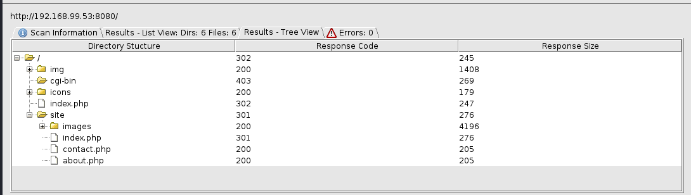

# Slort

Machine: [Slort](https://portal.offensive-security.com/labs/practice)\
Difficulty: Intermediate


## Enumeration
What ports are open? I used both namp and namp automator to enumerate the machine.


```
21/tcp    open  ftp           FileZilla ftpd 0.9.41 beta
| ftp-syst: 
|_  SYST: UNIX emulated by FileZilla
135/tcp   open  msrpc         Microsoft Windows RPC
139/tcp   open  netbios-ssn   Microsoft Windows netbios-ssn
445/tcp   open  microsoft-ds?
3306/tcp  open  mysql?
| fingerprint-strings: 
|   DNSStatusRequestTCP, FourOhFourRequest, GenericLines, GetRequest, HTTPOptions, Help, Kerberos, NULL, RPCCheck, RTSPRequest, SMBProgNeg, SSLSessionReq, TLSSessionReq, TerminalServerCookie, X11Probe: 
|_    Host '192.168.49.99' is not allowed to connect to this MariaDB server
4443/tcp  open  http          Apache httpd 2.4.43 ((Win64) OpenSSL/1.1.1g PHP/7.4.6)
| http-title: Welcome to XAMPP
|_Requested resource was http://192.168.99.53:4443/dashboard/
|_http-server-header: Apache/2.4.43 (Win64) OpenSSL/1.1.1g PHP/7.4.6
5040/tcp  open  unknown
7680/tcp  open  pando-pub?
8080/tcp  open  http          Apache httpd 2.4.43 ((Win64) OpenSSL/1.1.1g PHP/7.4.6)
| http-title: Welcome to XAMPP
|_Requested resource was http://192.168.99.53:8080/dashboard/
|_http-server-header: Apache/2.4.43 (Win64) OpenSSL/1.1.1g PHP/7.4.6
|_http-open-proxy: Proxy might be redirecting requests
49664/tcp open  msrpc         Microsoft Windows RPC
49665/tcp open  msrpc         Microsoft Windows RPC
49666/tcp open  msrpc         Microsoft Windows RPC
49667/tcp open  msrpc         Microsoft Windows RPC
49668/tcp open  msrpc         Microsoft Windows RPC
49669/tcp open  msrpc         Microsoft Windows RPC
Service Info: OS: Windows; CPE: cpe:/o:microsoft:windows

Host script results:
|_clock-skew: 1s
| smb2-security-mode: 
|   311: 
|_    Message signing enabled but not required
| smb2-time: 
|   date: 2023-03-19T15:18:20
|_  start_date: N/A

```

### Ports Info
#### FTP 21

#### SMB 139/445
Based on the output below, I do not believe smb is an attack vector. 
```
└─$ enum4linux -U -o 192.168.99.53
Starting enum4linux v0.9.1 ( http://labs.portcullis.co.uk/application/enum4linux/ ) on Sun Mar 19 11:47:21 2023

 =========================================( Target Information )=========================================                                                 
                                                                             
Target ........... 192.168.99.53                                             
RID Range ........ 500-550,1000-1050
Username ......... ''
Password ......... ''
Known Usernames .. administrator, guest, krbtgt, domain admins, root, bin, none


 ===========================( Enumerating Workgroup/Domain on 192.168.99.53 )===========================                                                  
                                                                             
                                                                             
[E] Can't find workgroup/domain                                              
                                                                             
                                                                             

 ===================================( Session Check on 192.168.99.53 )===================================                                                 
                                                                             
                                                                             
[E] Server doesn't allow session using username '', password ''.  Aborting remainder of tests.                                                            

```

#### MySQL

#### Panda Pub
I am not familiar with this but it is a file transfer service of some kind.

#### HTTP 4443
I used dirbuster, but I did not find anything present on this webserver.

#### HTTP 8080
Below are the partial results of the dirbuster scan.  I found a webpage titled 'Slort', so this seems to be a good indicator that we are on the right path.




In the url, I noticed that it is using a parameter called 'page'. This parameter could be levereged for LFI, or LFI to RCE.

### Other Enumeration
There are a number of unknown open ports on the target, but I will ignore them since I don't know what service, if any, is running on a port.


## Exploit


### Local/User flag


### Root Flag


