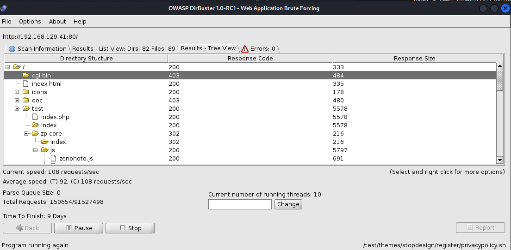
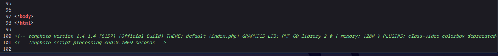
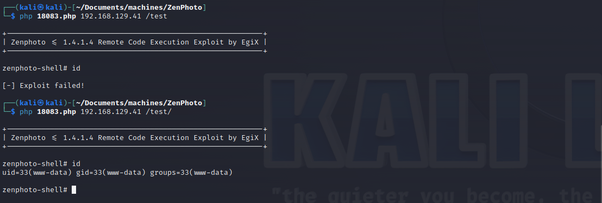
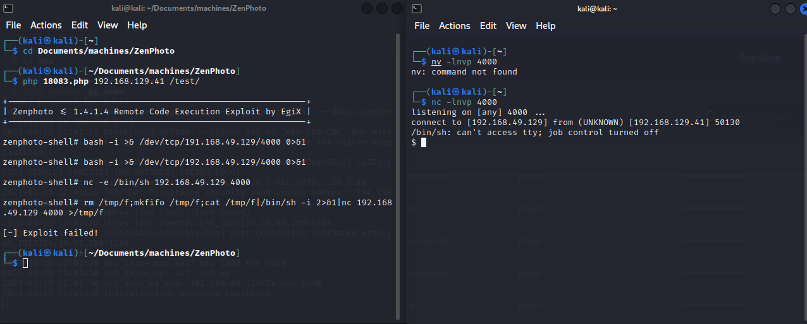
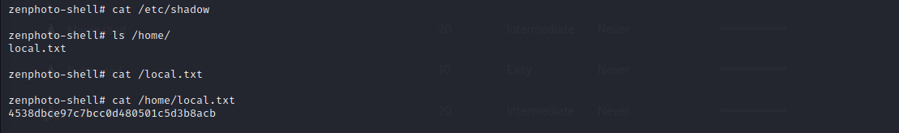
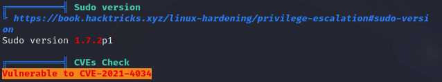
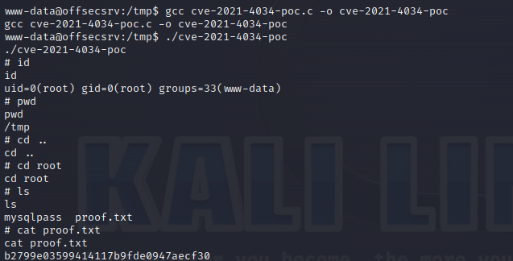

# ZenPhoto

Machine: [ZenPhoto](https://portal.offensive-security.com/labs/practice)\
Difficulty: Intermediate


## Enumeration
What ports are open?
```
PORT     STATE SERVICE VERSION
22/tcp   open  ssh     OpenSSH 5.3p1 Debian 3ubuntu7 (Ubuntu Linux; protocol 2.0)
23/tcp   open  ipp     CUPS 1.4
80/tcp   open  http    Apache httpd 2.2.14 ((Ubuntu))
3306/tcp open  mysql   MySQL (unauthorized)
Service Info: OS: Linux; CPE: cpe:/o:linux:linux_kernel
```

### Ports Info
#### SSH
I do not see anything vulnerable for this version of ssh. 

#### HTTP
The webpage is underconstruction and the directory scan results are shown below. Also, the version that is running on the port is vulnerable to a number of things, but I don't know if it pertains to this machine: https://www.rapid7.com/db/modules/auxiliary/dos/http/apache_mod_isapi/


In the page source, I did find a reference to 'ZenPhoto' in the html comments. 



#### IPP
I am not familar with this service nor am I familar with the verison so I had to do some research. CUPS is a printing system that uses the Internet Printing Protocol (IPP) as the basis for managing printers, print requests, and print queues. CUPS supports network printer browsing and PostScript Printer Description-based printing options. CUPS also provides a common printing interface across a local network. IPP is the only protocol that CUPS supports natively and is supported by most network printers and print servers.

It might be vulnerable to possible [remote command execution](https://www.exploit-db.com/exploits/41233) and [information disclosure](https://www.exploit-db.com/exploits/34152). 


#### MSQL
I did not find any users, so I don't think this will serve a purpose. This might be useful to comeback and review later once we can get a shell.  It is possible that a root password is stored in the config files for MySQL.


## Exploit
In the directory scan, I did find a page that uses ZenPhoto. I did not know that it is a theme used in a page. This leads me to believe this is the [vulnerability](https://www.exploit-db.com/exploits/18083). I exectuted the script, and I managaged to get a shell as www-data so I upgraded the shell.




### Local/User flag


### Root Flag
I uploaded linpeas to the target machine to help escalate privileges.


Used this exploit to priv esc, https://github.com/arthepsy/CVE-2021-4034.


