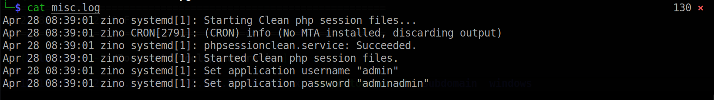

# Blocky

Machine: [Zino](https://portal.offensive-security.com/labs/practice)\
Difficulty: Intermediate

## Enumeration
What ports are open?

What are the versions of the services?
21/ftp - vsftpd 3.0.3
22/ssh - OpenSSH 7.9p1 Debian 10+deb10u2 
139/Samba smbd - 3.X - 4.X
445/netbios-ssn Samba smbd - 4.9.5-Debian 
3306/mysql - 
8003/http - Apache httpd 2.4.38

### Ftp
The version of ftp installed on this machine does not seem to be of any use to me. There is a vulnerability for this version of ftp, but it is related to denial of service (DOS). Next, I tried to login as 'anonymous/anonymous' but that did not work.

### Ssh
At first glance, this version does not appear to be vulnerable to anything. However, if I find any credentials then I might be able to use them via ssh to login.

### Smb
To enumerate smb I used a couple of tools. First, I used smbmap to list the shares on this machine. Second, I used smbclient to copy any files on the share I had permissions to read to my local machine.
<pre>smbmap -H 192.168.213.64</pre>

<pre>smbclient //192.168.213.64/zino</pre>

Surely enough the share had the local.txt flag for this machine! There are two other files that I thought had intersting information is the auth.log file and misc.log file. I know that there is a user named 'peter' but I was not able to ssh into the machine as peter...so maybe I might need to brute force the password but I will wait for that.

In the misc.log file, there is a set of credentials admin/adminadmin. I tried to login as root via ssh and use the password that I just found, but I was not able to login.

### Mysql
I don't know what version of MySql is running, but when I tried to login I kept getting this error below.
Error: ERROR 2002 (HY000): Can't connect to local MySQL server through socket '/run/mysqld/mysqld.sock' (2)

### Http
I get redirected to a booked/web directory which seems to just be a login page. At the bottom of the login page, we can see the software name and version that the website is using.

A quick search online reveals that this version is vulnerable to RCE. Exploit [here](https://www.exploit-db.com/exploits/50594). This exploit does require a set of credentials, so I remember that I found another set of creds in the misc.log. Those credentials, admin/adminadmin, allow me to login to the page.

## Exploitation
I was able to get a shell by follwoing this [exploit](https://www.exploit-db.com/exploits/50594), but I could not move out of the directory...I think this is because I have a shell as www-data. 

### Flags

#### User/Local flag

#### Root flag

